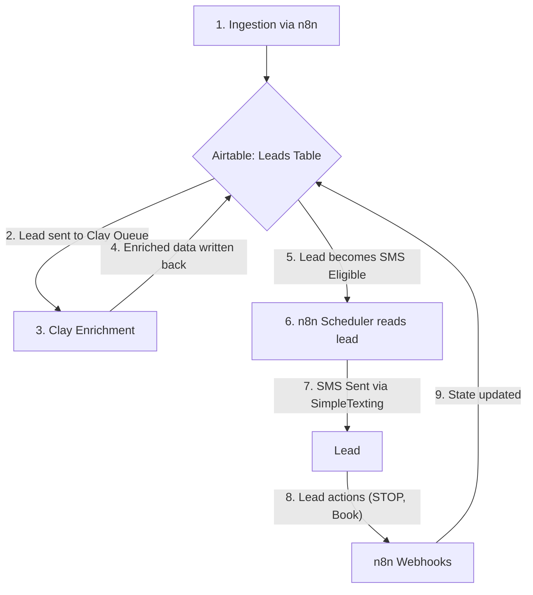

# UYSP System Runbook & AI Guardrail

**Version:** 1.0
**Date:** 2025-09-17
**Purpose:** This document is the single source of truth for the UYSP Lead Qualification system. It is a mandatory context file for any AI agent or developer performing work on this system. Its primary purpose is to prevent unintentional, catastrophic changes by making the system's architecture, dependencies, and critical business logic explicit and unavoidable.

---

## 1. 🚨 CRITICAL WARNINGS & OPERATIONAL OVERVIEW

### 1.1. DO NOT MODIFY WITHOUT FOLLOWING PROTOCOL
- **WARNING**: This is a live, complex business application. Uninformed changes have previously caused catastrophic failures, including mass messaging incidents.
- **MANDATE**: Any proposed change, no matter how small, **must** follow the **Change Management Protocol** outlined in Section 5 of this document.
- **Primary Directive**: Your goal is safety and stability. Do not optimize, refactor, or "improve" any component without a clear, evidence-backed proposal that has been approved.

### 1.2. System Architecture: The Three Pillars
The system is a distributed application built on three distinct platforms. A change in one platform will have a direct and significant impact on the others.

1.  **Airtable (The "Brain"):**
    *   **Role:** Central database, state machine, and configuration store.
    *   **Location:** Base `UYSP Lead Qualification Final (Option C)` (`app6cU9HecxLpgT0P`).
    *   **Function:** It holds the definitive state of every lead and contains the core business logic in its formula fields. **Airtable is the single source of truth.**

2.  **Clay (The "Enrichment Engine"):**
    *   **Role:** Primary data enrichment and validation service.
    *   **Function:** It takes raw lead data from Airtable, enriches it with critical information (like `Location Country`), validates phone numbers, and writes the results back to Airtable.

3.  **n8n (The "Automation Engine"):**
    *   **Role:** Process automation and communication handler.
    *   **Function:** It executes the core business processes, such as sending SMS messages and handling inbound webhooks, based on the state and configuration defined in Airtable.

### 1.3. High-Level Data Flow Diagram
This diagram illustrates the end-to-end journey of a lead through the system.


---
*Next Section: The Data Supply Chain*

---
## 2. THE DATA SUPPLY CHAIN: FROM INGESTION TO ELIGIBILITY

The SMS Scheduler is the final step in a multi-stage data pipeline. Its ability to function correctly is **100% dependent** on the successful execution of the upstream ingestion and enrichment processes.

### 2.1. Lead Ingestion (`UYSP Backlog Ingestion`)
- **Workflow ID**: `qMXmmw4NUCh1qu8r` (Inactive; Manual Trigger)
- **Source**: A hardcoded Google Sheets CSV URL.
- **Function**: This workflow is the primary entry point for new leads into the system. It fetches raw data, performs initial normalization (sanitizing emails, standardizing phone numbers), and performs a critical first-pass validation.
- **Key Outputs to `Leads` Table**:
  - `Phone`: The raw, normalized phone number.
  - `HRQ Status`: Sets to "Archive" if the initial data is invalid, immediately disqualifying the lead.
  - `Current Coaching Client`: Sets a flag based on Kajabi tags.

### 2.2. The Clay Enrichment Process
- **Source of Truth**: `docs/sops/SOP-Integration-Clay.md`
- **Trigger**: An Airtable view (the "Clay Queue") that contains leads ready for enrichment.
- **Function**: This is the primary enrichment engine. It takes the raw data from the ingestion workflow and adds the critical intelligence needed for the scheduler to make a decision.
- **Key Outputs to `Leads` Table**:
  - **`Phone Valid` (Boolean)**: This is the **definitive signal** from a paid service that the phone number is real and contactable.
  - **`Location Country` (String)**: This is the **definitive geographic signal** used for compliance.
- **Point of Failure**: This process has been identified as a point of failure where `Location Country` is not always populated, even when `Phone Valid` is set to true. The Airtable Automation, `Backfill Missing Country`, was created to act as a safety net for this specific failure mode.

### 2.3. The Critical Upstream Dependencies for the SMS Scheduler
The SMS Scheduler's master query (`List Due Leads`) will **never** select a lead unless the following upstream processes have run successfully:
1.  The `UYSP Backlog Ingestion` workflow must have successfully imported the lead without immediately archiving it.
2.  The Clay enrichment process must have run and set the **`Phone Valid`** field to `true`.
3.  Either the Clay process or the `Backfill Missing Country` automation must have successfully populated the **`Location Country`** field.

**Conclusion**: A failure in any of these upstream steps will silently exclude a lead from the outreach process.
---
*Next Section: Airtable: The Single Source of Truth*

---
## 3. AIRTABLE: THE SINGLE SOURCE OF TRUTH

Airtable is not just a database; it is an active component of the application where critical business logic is defined and executed. A misunderstanding of this section is the most likely cause of catastrophic failure.

### 3.1. Key Tables

| Table Name | Purpose | Criticality |
| :--- | :--- | :--- |
| **`Leads`** | The central table for all lead data, statuses, and scores. | **CRITICAL**. The state of this table dictates all system behavior. |
| **`Settings`** | Global configuration for the system (A/B ratios, feature flags). | **CRITICAL**. A misconfiguration here can alter the behavior of the entire scheduler. |
| **`SMS_Templates`** | Stores the message content for every step and variant. | **CRITICAL**. A missing template will cause silent failures in the SMS sequence. |
| **`SMS_Audit`** | An immutable log of all SMS send attempts and delivery receipts. | **High**. Essential for compliance, debugging, and historical reporting. |

### 3.2. Forensic Analysis: The `{SMS Eligible}` Formula Field

This formula field is the **single most important piece of logic** for defining the target audience for SMS outreach. It is a non-negotiable compliance and quality gate.

- **Location**: `Leads` Table
- **Formula Definition:**
  ```
  AND(
    {Phone Valid},
    OR(
      SEARCH("united states", LOWER({Location Country})),
      SEARCH("canada", LOWER({Location Country}))
    ),
    {HRQ Status} != "Archive",
    NOT({Current Coaching Client}),
    NOT({SMS Stop}),
    NOT({Booked})
  )
  ```
- **Analysis**:
  - This formula combines signals from multiple upstream processes (Clay enrichment, manual review, inbound webhooks) into a single, definitive boolean value.
  - The `SEARCH()` function was implemented to be resilient to variations in the `Location Country` data.
  - **WARNING**: Any change to this formula has the potential to either halt all SMS outreach or, worse, send messages to a non-compliant or incorrect audience. It must not be modified without following the full Change Management Protocol.

### 3.3. Key Field Deep Dive: `{SMS Batch Control}`
- **Type**: Single-select text field in the `Leads` table.
- **Purpose**: This field functions as a **manual, per-record safety switch and batching tool**. It is **not** a global toggle.
- **Operational Logic**:
  1. An operator manually selects a cohort of leads (e.g., 100 records) in the Airtable UI.
  2. The operator bulk-updates the `{SMS Batch Control}` field to `Active` for this specific cohort.
  3. The `UYSP-SMS-Scheduler-v2` workflow will *only* consider leads that have had this field manually set to `Active` (if their status is 'Ready for SMS').
- **Conclusion**: This is a critical, manual step in the process that prevents the scheduler from running away with the entire database. It is the primary mechanism for controlling the flow of new leads into the SMS funnel.

### 3.4. Key Field Deep Dive: `{Current Coaching Client}`
- **Type**: Checkbox field in the `Leads` table.
- **Purpose**: This field acts as a critical "do not contact" flag for active customers.
- **Source of Truth**: The logic for setting this field resides entirely within the **`Normalize` code node of the `UYSP Backlog Ingestion` workflow**. It is **not** an Airtable formula.
- **Operational Logic**: The field is set to `true` during the import process if the `{Kajabi Tags}` for that lead meet a specific set of rules:
  1. The tags must **NOT** contain the word `alumni`.
  2. The tags **MUST** contain a tier name (`platinum`, `gold`, `silver`, or `bronze`).
  3. The tags **MUST ALSO** contain a context word (`coach`, `annual`, `lifetime`, `member`, or `membership`).
- **Conclusion**: This is an automated check during ingestion, but its accuracy is entirely dependent on the consistency of the tags coming from Kajabi.

### 3.3. Forensic Analysis: Other Key Formula Fields

Other formulas in the `Leads` table also contain important business logic that the system depends on.

- **`{ICP Score}` Formula**:
  - **Definition**: Sums several component score fields (`Company Score Component`, `Role Score Component`, `Location Score Component`, etc.).
  - **Analysis**: While the SMS Scheduler does not currently use this score in its *targeting*, it is a critical business metric. Any changes to the component fields will implicitly change this score, which could impact future analytics or lead routing decisions.

- **`{Location Score Component}` Formula**:
  - **Definition**: Assigns a score based on keywords in the `Location Country` field.
  - **Analysis**: This is another example of "hidden logic." It contains a tiered model for geographic value (US > UK/Canada > Western Europe). This logic is part of the ICP scoring, not the compliance check.

**Conclusion**: Airtable is not a passive data store. It contains active, complex business logic that is critical to the correct operation of the entire system.
---
*Next Section: N8N: The Automation Engine*

---
## 4. N8N: THE AUTOMATION ENGINE

n8n is the component responsible for executing the business processes. It reads its instructions and configuration from Airtable, interacts with external APIs, and writes the results back to Airtable.

### 4.1. Workflow Catalog

This table summarizes the critical workflows and their roles.

| Workflow Name | ID | Status | Purpose |
| :--- | :--- | :--- | :--- |
| **`UYSP-SMS-Scheduler-v2`** | `UAZWVFzMrJaVbvGM` | Inactive | The primary engine for all outbound SMS outreach. |
| **`UYSP-ST-Delivery V2`** | `vA0Gkp2BrxKppuSu` | Active | Handles inbound delivery receipts from the SMS provider. |
| **`UYSP-SMS-Inbound-STOP`** | `pQhwZYwBXbcARUzp` | Active | Handles inbound STOP/UNSTOP compliance messages. |
| **`UYSP-Calendly-Booked`** | `LiVE3BlxsFkHhG83` | Active | Handles inbound webhooks when a lead books a meeting. |
| **`UYSP Backlog Ingestion`** | `qMXmmw4NUCh1qu8r` | Inactive | The primary workflow for importing new leads from a CSV. |

### 4.2. Deep Dive: The `UYSP-SMS-Scheduler-v2`
This workflow is the most complex and critical component in n8n. Its logic is broken down in detail in the `DEEP-DIVE-SMS-SCHEDULER-ANALYSIS.md` document, but the most important safety features are summarized here.

- **Hardcoded Safety Gates**: The workflow contains several non-negotiable safety rules that are implemented directly in the `Prepare Text (A/B)` code node:
  - **Time Window**: Will only execute between 9 AM and 5 PM Eastern Time.
  - **Batch Size**: Will only process a maximum of 25 leads per run.
  - **24-Hour Lock**: Will not send a message to any lead who has received one in the last 24 hours.
- **Stateful Logic**: The workflow's primary function is to read the state of a lead from Airtable (e.g., `SMS Sequence Position`), apply its logic, and then write the new state back to Airtable (e.g., incrementing the sequence position).

### 4.3. Deep Dive: Inbound Event Handlers
The three active workflows (`ST-Delivery`, `SMS-Inbound-STOP`, `Calendly-Booked`) all follow the same fundamental pattern:
1.  **Receive an Event**: An external service (SimpleTexting, Calendly) sends a webhook to n8n when an event occurs.
2.  **Parse and Identify**: A Code node extracts the key identifier from the event (usually a phone number or email address).
3.  **Find the Record**: An Airtable node finds the corresponding record in the `Leads` table.
4.  **Update the State**: Another Airtable node updates one or more status fields on that record (e.g., sets `SMS Stop` to true, sets `Booked` to true, sets `SMS Status` to "Delivered").

**Conclusion**: The n8n workflows are the "hands" of the system, performing actions based on the "brain" in Airtable. The scheduler is a proactive engine, while the inbound handlers are reactive.
---
*Next Section: Change Management Protocol*

---
## 5. 📜 CHANGE MANAGEMENT PROTOCOL (NON-NEGOTIABLE)

**This protocol is mandatory for any and all changes to the UYSP system, no matter how small.** Its purpose is to prevent a recurrence of past catastrophic failures by enforcing a systematic, evidence-based process for all modifications.

### 5.1. The "Simplest Path First" Principle
- **Rule**: For any problem, the proposed solution must start with the simplest possible implementation. Do not propose a complex code-based solution if a native, no-code feature in Airtable or n8n can achieve the same outcome.
- **Example**: The `Backfill Missing Country` logic was correctly implemented as a no-code Airtable Automation, which is simpler and more maintainable than a custom script in an n8n workflow.

### 5.2. The Mandatory 5-Step Change Proposal Process
Before any implementation begins, a formal proposal must be presented that includes the following five sections:

1.  **Hypothesis & Problem Definition**: A clear, concise statement of the problem and a hypothesis for why the proposed change will solve it.
    - *Example: "Hypothesis: The scheduler's performance is slow because of redundant logic in the Airtable query. Simplifying the query will reduce execution time."*

2.  **Impact Analysis**: A detailed assessment of which components will be affected by the change. This must include:
    - All Airtable tables, fields, and formulas.
    - All n8n workflows and specific nodes.
    - All external services (Clay, SimpleTexting, etc.).
    - Any downstream reporting or analytics.

3.  **Implementation Plan**: A step-by-step description of the exact changes to be made.
    - For Airtable formula changes, provide the complete "before" and "after" formulas.
    - For n8n code changes, provide the complete code block, not just a diff.

4.  **Testing Plan**: A concrete plan to validate the change and ensure it has not caused unintended side effects.
    - **Minimum Requirement**: The plan must include a method for running the "old" and "new" logic in parallel to prove the outputs are identical before deploying to production.
    - *Example: "Create a new `{SMS Eligible (V2)}` formula and a corresponding test view. Compare the record counts in the old and new views for 48 hours to ensure consistency before updating the main workflow."*

5.  **Rollback Plan**: A clear procedure for reverting the change in case of failure.
    - *Example: "If the new formula causes errors, we will immediately revert to the previous formula, which has been stored in the field's description."*

### 5.3. A Guide to Safe Testing
- **Isolate Changes**: Never bundle multiple, unrelated changes into a single deployment.
- **Use Test Records**: Always test with a dedicated set of test records in Airtable before running on live data.
- **Verify End-to-End**: A change is not "done" when the code is deployed. It is done when you have verified the entire process, from ingestion to the final Airtable state update, and confirmed that the outcome is correct.
- **Monitor Executions**: After deploying a change, actively monitor the execution logs in n8n and the data in Airtable to confirm that the system is behaving as expected.
