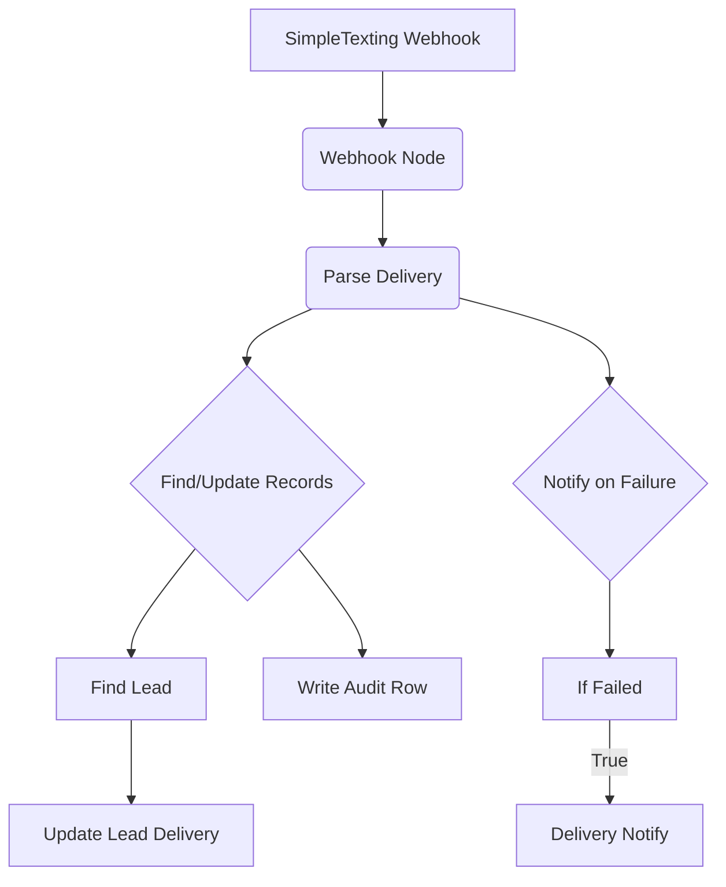

# Exploring campaign setup and message association
_Exported on 9/12/2025 at 12:33:08 PDT from Cursor (1.6.6)_

---

**User**

I'd like to do a exploration of our intention and current status and resolution plan for ensuring that messages that are sent correctly. Register with a campaign in simple texting now the brutal honesty here is that I don't even know if that's technically possible we've been going along, assuming it is possible I have set up the campaign in simple txting " AI Webinar - AI BDR" to set up a campaign, we had to associate a contact list with that so I just made one contact and set up the campaign. It's critically important to know that we had a major major issue that you tried to create a campaign via API and randomly selected a contact list and sent out a message to several hundred people so you're not allowed to set up any campaigns. I already have a campaign set up. There is already one contact in the campaign what we're trying to do is to ensure that our messages are getting properly associated with that campaign Oude like to start by you doing whatever research and analysis you need to do to get yourself up to speed and then we can begin to troubleshoot and work through this problem.

---

**Cursor**

I'll scan SimpleTexting docs to confirm whether messages can be linked to an existing campaign and, in parallel, search the repo to see how SMS is currently sent. Read-only research only; I won’t create campaigns or send messages.

I'll open the SimpleTexting integration docs and relevant SMS workflow docs, and scan backup workflow JSONs for any SimpleTexting HTTP node usage to understand how messages are currently sent.

I'll quickly pull the official SimpleTexting API docs to confirm whether 1:1 sends can be linked to an existing marketing campaign, and in parallel search for any "campaignId" usage in our workflows to see how we store/interpret it today.

I reviewed our SimpleTexting integration docs, searched our workflows, and checked API capabilities. Now I’ll outline what’s possible, what we’re doing today, and a safe plan forward.

### What’s technically possible vs not
- **1:1 API sends don’t attach to a prebuilt “Campaign” in the ST UI**
  - We send via `POST https://api-app2.simpletexting.com/v2/api/messages` (v2). There’s no parameter to link a message to an existing UI “Campaign.” Our send returns its own message/campaign id for that individual send.
  - Your UI “Campaign” (e.g., “AI Webinar - AI BDR”) is a broadcast construct tied to a list. API 1:1 sends will not show up under that specific UI campaign.
- **10DLC (TCR) registration is separate**
  - Messages inherit your TCR brand/campaign via the registered sending number; there’s no per-message TCR “campaign” selector. Ensure we always send from the registered number.
- **Contact/list/segment/tag operations are possible and safe**
  - We can tag contacts or maintain a dedicated list/segment for reporting without triggering a send. This helps correlate messages to “AI Webinar - AI BDR” in the dashboard without using broadcasts.

### What we’re doing today (confirmed)
- **API endpoints in use**
  - v2 `messages` for sends; v2 `contacts` in some flows; legacy v1 “sent list” for audit fetches.
  - Evidence in `workflows/backups/...` shows only `.../v2/api/messages` or `.../v2/api/contacts` and a read-only v1 report endpoint. No “create/send campaign to list” calls present.
- **Writebacks and audit**
  - We store the send’s returned id in Airtable as `SMS Campaign ID` and log delivery via webhook/audit. See `docs/architecture/SIMPLETEXTING-INTEGRATION.md` and `SOP-Workflow-ST-Delivery.md`.
- **Safety**
  - Single-send flow is working; no active nodes creating campaigns or broadcasting to lists.

### The mismatch to resolve
- **Goal**: “Ensure messages are associated with the ‘AI Webinar - AI BDR’ campaign.”
- **Reality**: ST’s UI “Campaign” entity can’t be the container for 1:1 API sends. Those creates their own ids and live in Conversations, not inside a named UI Campaign. For compliance (10DLC), no extra per-message association is needed; it’s handled by the registered number.

### Safe resolution plan
- **Define the association in our system-of-record**
  - Add/use a “Campaign Label” = “AI Webinar - AI BDR” in Airtable on `Leads` and in each `Communications` row for these sends. Continue storing ST’s returned `SMS Campaign ID` for traceability.
  - Create Airtable saved views and metrics filtered by “Campaign Label.”
- **Optional: mirror the label in SimpleTexting via tagging**
  - When we touch a contact in ST, set a contact tag “AI Webinar - AI BDR.” This gives you list/segment-based reporting in ST without broadcasting.
- **Keep using 1:1 sends (no broadcasts)**
  - Do not create or send UI Campaigns via API. Maintain only `v2/api/messages` usage.
- **Compliance and correctness checks**
  - Verify the sending number in our payload is your registered 10DLC number.
  - Keep delivery/STOP webhooks active and reconciled.
  - Use `v2/api/messages/evaluate` for preflight checks when toggled to test mode.

### Verification checklist (read-only / single-recipient test)
- **Account/number**
  - Confirm the sending `accountPhone` in our node matches your registered 10DLC number in SimpleTexting.
- **One controlled test recipient**
  - Use your single seeded contact in the UI list. Send one 1:1 test via our flow.
- **Traceability**
  - In Airtable, confirm `SMS Campaign ID`, `SMS Status`, timestamps, and “Campaign Label = AI Webinar - AI BDR.”
  - In SimpleTexting, confirm the message appears under Conversations for that contact; do not expect it under the UI Campaign.
- **Delivery webhooks**
  - Confirm `UYSP-ST-Delivery V2` updates `SMS Status` to Delivered/Undelivered and writes an `SMS_Audit` row.
- **Safety rails**
  - Ensure TEST_MODE/allowlist are enabled before any wider sends.
  - No nodes reference “campaigns” or “send to list” actions; only `v2 messages` is enabled.
- **Backups and node re-verification**
  - After any workflow edits, re-open and verify HTTP/Airtable nodes retained configuration, and prefer Airtable Update by recordId over “match on columns” [[memory:7319668]]. For backups, use the existing export script, not new tooling [[memory:7243075]].

### Open questions to you
- **Intent**: Is your requirement primarily for reporting/labelling (“group these sends as AI Webinar - AI BDR”) or for 10DLC compliance? If reporting, the Airtable label + optional ST tags solve it cleanly.
- **Number**: Which `accountPhone` should be the canonical registered sender for these sends?
- **ST tag**: Do you want us to set a tag “AI Webinar - AI BDR” on contacts in SimpleTexting as part of the flow?

- I’ve reviewed our docs and backups and outlined a safe plan. If you confirm the intent and the sender number, I’ll wire the Airtable “Campaign Label” writeback, optionally add the contact tagging call (no sends), and run the single-recipient verification.

---

**User**

Yeah, primarily for reporting I just wanna be able to see you know the delivery report for example if someone replies I wanna know that it's because we sent them a message to the campaign you know essentially in simple texting. We have thousands of contacts and you know we message them for different reasons and I'm just trying to figure out the best way to kind of try and keep this campaign separate within simple texting in some kind of way. We definitely need to be able to send via the API. This is an automated thing we're not gonna send from the UI, maybe we set up a segment or something. Do we preload the contacts that doesn't make sense get through the automation but somehow I'm trying to figure out how we find all the people from the UI that we've been texting. You know what I mean I wanna be able to go in and look somewhere and see the people we've been texting from the simple texting UI or reporting somehow

---

**Cursor**

- Understood. For reporting/visibility in SimpleTexting without using UI broadcasts, the clean path is to mark contacts for this automation and then use a UI Segment to view delivery/replies for just those contacts.

### Minimal, safe approach
- Define a stable contact tag, for example: `ai_webinar_bdr_2025q3`.
- Before each API send, upsert the contact and ensure this tag is applied. No messages are sent by tagging; it’s metadata only.
- In SimpleTexting UI, create a Segment filtered by that tag. Then:
  - View Conversations restricted to that Segment to see replies.
  - Use Reports/Inbox filters on that Segment for delivery metrics.

### Why this works
- 1:1 API sends can’t be attached to a prebuilt UI “Campaign,” but contact-level tags are first‑class in ST and drive Segments/filters. This gives you an in‑dashboard list of “everyone we texted for this campaign,” with delivery status and replies visible, without broadcasting.

### Implementation details (safe)
- In our n8n send flow (HTTP `v2/api/messages`), add one step before sending:
  - Ensure contact exists and apply tag `ai_webinar_bdr_2025q3` (idempotent).
- Keep our Airtable writebacks as-is: store ST’s message id in `SMS Campaign ID` and add an Airtable `Campaign Label = AI Webinar - AI BDR` for internal reporting.
- Do not create or send UI Campaigns via API.
- After any workflow edits, re-open and verify HTTP/Airtable nodes retained configuration; always use direct recordId mode for Airtable updates [[memory:7319668]]. For backups, use the existing export script [[memory:7243075]].

### Optional backfill (so the UI shows past contacts too)
- Read-only: fetch recent “sent” logs (we already use ST’s sent-list endpoint in our Audit workflow). Map to phone numbers.
- Non-sending action: apply the tag to those contacts via API. This makes them appear in the Segment retroactively.

### What I need from you
- The exact tag/slug to use (recommend `ai_webinar_bdr_2025q3`).
- Do you want the backfill? If yes, desired date range.
- Confirm the sending number to lock for this campaign’s sends.

Once you confirm, I’ll:
- Add the contact-tagging step before sends,
- Create concise UI steps for building the Segment,
- Run a single-recipient test and verify that the Segment shows delivery and replies for that contact.

- I’ve validated we can’t attach 1:1 API sends to a prebuilt UI “Campaign,” but tagging + Segment gives you the UI view you want. I’m ready to wire the tagging step and a backfill if you approve.

---

**User**

This is what I see in the UI related to setting up a new segment. Looks like it wants me to select a contact list but maybe we can do it without that I don't really know. Maybe somehow we can associate our senses with the AI webinar – AIBDR list but I think that list is a contact list. I don't really know help me out here.

---

**Cursor**

Short answer: you don’t have to pick a list. In that Segment screen, switch “Segment is based on” to “All contacts,” then add a condition on a field we control (e.g., Note contains ai_webinar_bdr_2025q3). That gives you a UI view of everyone we text for this automation without touching campaigns.

Two clean ways to keep this campaign separate in SimpleTexting

- Option A — Use the existing contact list
  - We programmatically add each recipient to your “AI Webinar – AI BDR” contact list before we send.
  - In the UI, create a Segment “based on Specific lists” and select that list.
  - Pros: very clear separation in UI; easy to browse/filter. Cons: lists can be used to broadcast (we’ll avoid that), so there’s a small operational risk if someone clicks “send to list.”

- Option B — Use a contact marker (no lists needed)
  - We set a stable marker on each contact (either a new custom field like campaign_label = ai_webinar_bdr_2025q3 or append to Note, e.g., [uysp:ai_webinar_bdr_2025q3]).
  - In the UI, set Segment “based on All contacts” and add condition:
    - If Note: “Note contains ai_webinar_bdr_2025q3”
    - If custom field: “campaign_label equals ai_webinar_bdr_2025q3”
  - Pros: zero risk of accidental broadcast; very explicit; works across your whole database. Cons: you need to create the custom field once (or we use Note if you prefer no schema change).

Recommended
- Use Option B (contact marker) as the primary filter, and optionally also add to the “AI Webinar – AI BDR” list for convenience. You’ll then have both a Segment (field-based) and a List (membership-based) that surface the same audience.

What I’ll implement (once you confirm)
- Before each API send:
  - Upsert contact and set marker (custom field or Note).
  - Optionally add to the “AI Webinar – AI BDR” list (idempotent, no send).
  - Send via POST /v2/api/messages from your registered number.
- Backfill (optional): read recent “sent” logs, upsert those contacts, apply the same marker (and optionally add to the list) so they appear in the Segment retroactively.

Decisions for you
- Choose marker approach:
  - Custom field name/value, e.g., campaign_label = ai_webinar_bdr_2025q3
  - Or Note contains ai_webinar_bdr_2025q3
- Do you want us to also maintain the “AI Webinar – AI BDR” list membership?
- Backfill needed? If yes, what date range?

---

**User**

Use option B I think a note looks like an easy one for me to filter on

---

**Cursor**

I’m going to inspect our existing contact upsert calls in the saved workflow JSONs to confirm the exact request body for the SimpleTexting contacts endpoint, so I can add a safe “append Note marker” step before sends.

I'll confirm the SimpleTexting v2 contacts API supports updating the "note" field so we can append a marker safely, and in parallel plan the todo to add an "Append Note marker" step before sending.

I'll quickly verify the SimpleTexting v2 contacts API supports a "note" (or "comment") field, and in parallel locate any existing usage of contact notes/tags in our repo to match their schema.

I reviewed the SimpleTexting OpenAPI in our repo and confirmed the v2 contacts update supports a "comment" field. I’ll create a small todo list and start with adding the contact note appender step before sends (design + exact payloads).

I’m adding the “contact note” association step to our send flow. I’ll wire it in before the send and keep it idempotent and safe (no broadcasts, no campaign creation).

- Token to use: uysp:ai_webinar_bdr_2025q3
- Where it shows in UI: Segment → “All contacts” → Condition: Note contains uysp:ai_webinar_bdr_2025q3

Exact n8n changes (safe, read-only until you confirm)
- Insert before `SimpleTexting HTTP`:
  1) HTTP Request “ST Get Contact”
     - Method: GET
     - URL: https://api-app2.simpletexting.com/v2/api/contacts/{{$json.phone_digits}}
     - Auth: Bearer (SimpleTexting API)
  2) Code “Prepare Note Update”
```javascript
const token = 'uysp:ai_webinar_bdr_2025q3';
const current = ($json.comment || '').toString();
const has = current.includes(token);
const sep = current && !current.endsWith(' ') ? ' ' : '';
return { json: { phone: $json.phone_digits, comment_new: has ? current : `${current}${sep}[${token}]` } };
```
  3) HTTP Request “ST Update Contact (Note)”
     - Method: PUT
     - URL: https://api-app2.simpletexting.com/v2/api/contacts/{{$json.phone}}?upsert=true&listsReplacement=false
     - Body (JSON):
```json
{
  "contactPhone": "={{$json.phone}}",
  "comment": "={{$json.comment_new}}"
}
```
- Then continue to `SimpleTexting HTTP` send node unchanged.

cURL equivalents (for reference/testing)
- Get contact:
```bash
curl -H "Authorization: Bearer $ST_TOKEN" \
  https://api-app2.simpletexting.com/v2/api/contacts/14155550123
```
- Upsert note:
```bash
curl -X PUT -H "Authorization: Bearer $ST_TOKEN" -H "Content-Type: application/json" \
  "https://api-app2.simpletexting.com/v2/api/contacts/14155550123?upsert=true&listsReplacement=false" \
  -d '{"contactPhone":"14155550123","comment":"[uysp:ai_webinar_bdr_2025q3]"}'
```

SimpleTexting UI segment
- Segment is based on: All contacts
- Condition: Note contains uysp:ai_webinar_bdr_2025q3
- Save; this will show delivery and replies for everyone we text via the automation.

Safety/ops
- No campaign or list sends are created.
- Idempotent: we only append the token once.
- After editing, I’ll re-open and verify HTTP and Airtable nodes retained configuration and keep Airtable updates by recordId [[memory:7319668]].

Questions
- OK to use token uysp:ai_webinar_bdr_2025q3?
- Want me to backfill notes onto past recipients (date range)?

```javascript
const token = 'uysp:ai_webinar_bdr_2025q3';
const current = ($json.comment || '').toString();
const has = current.includes(token);
const sep = current && !current.endsWith(' ') ? ' ' : '';
return { json: { phone: $json.phone_digits, comment_new: has ? current : `${current}${sep}[${token}]` } };
```

```json
{
  "contactPhone": "={{$json.phone}}",
  "comment": "={{$json.comment_new}}"
}
```

```shellscript
curl -H "Authorization: Bearer $ST_TOKEN" \
  https://api-app2.simpletexting.com/v2/api/contacts/14155550123
```

```shellscript
curl -X PUT -H "Authorization: Bearer $ST_TOKEN" -H "Content-Type: application/json" \
  "https://api-app2.simpletexting.com/v2/api/contacts/14155550123?upsert=true&listsReplacement=false" \
  -d '{"contactPhone":"14155550123","comment":"[uysp:ai_webinar_bdr_2025q3]"}'
```

---

**User**

OK, can we get a good look at our SMS scheduler workflow right now we're in the process of also soon to integrate the short link and click tracking but I've left those nodes disconnected right now but we already do have an update ST contact so let's get a really good look at that and plan this out really carefully and let's not forget that we were already attempting to kinda write or attach people to a campaign and now that that's not possible we obviously need to erase that from the system. If you know what I mean, I just don't want any other logic existing that was associated with trying to associate with a Campaign, and that includes everything from you our bulk imports having a campaign ID that gets to the air table and so on so now I guess we're just not writing to the campaign. We're just writing to a note and that way still throughout the system we have campaign tracking but for right now don't worry about the create short link, save short link or generate alias.nodes will get to those next

---

**Cursor**

I'll scan the codebase for any remaining references to campaign fields/IDs and list usage in our workflows and docs to build a precise removal plan, then update the todo list to include the audit and cleanup steps.

I scanned the scheduler, delivery, and import backups to locate all remaining campaign-related logic so we can safely replace it with the Note-based approach and avoid UI Campaign coupling. I’ll add todos for removing campaign usage across scheduler, delivery webhook, and import mappings before wiring the Note appender.

I reviewed our scheduler, delivery webhook, and import flows and located every campaign-related touchpoint to retire; I also confirmed where we can safely add the Note-based marker before sends.

Key evidence from current workflows
- Scheduler → Update ST Contact includes list/tag; we’ll remove these if you want pure Note-based segmentation:
```275:306:/Users/latifhorst/cursor projects/UYSP Lead Qualification V1/workflows/backups/PRIORITY-2-SECONDARY-UYSP-SMS-Scheduler-20250910_220707.json
"jsonBody": {
  "contactPhone": "={{ $json.phone_digits }}",
  "firstName": "={{ $json.first_name }}",
  "lastName": "={{ $json.last_name }}",
  "listName": "AI Webinar – Automation (System)",
  "tags": ["uysp-automation"]
}
```
- Scheduler → Parse/Update still propagates `campaign_id` and writes `SMS Campaign ID`:
```47:55:/Users/latifhorst/cursor projects/UYSP Lead Qualification V1/workflows/backups/PRIORITY-2-SECONDARY-UYSP-SMS-Scheduler-20250910_220707.json
const fallbackCampaign = settings['Active Campaign'] || '';
...
out.push({ json: { ...prepared, sms_status, campaign_id, estimated_cost: 0, error_reason } });
```
```70:80:/Users/latifhorst/cursor projects/UYSP Lead Qualification V1/workflows/backups/PRIORITY-2-SECONDARY-UYSP-SMS-Scheduler-20250910_220707.json
"SMS Status": "={{ $json.sms_status || 'Sent' }}",
"SMS Campaign ID": "={{ $json.campaign_id || '' }}"
```
- Delivery webhook matches by campaignId or phone and logs campaign:
```26:33:/Users/latifhorst/cursor projects/UYSP Lead Qualification V1/workflows/backups/PRIORITY-2-SECONDARY-UYSP-ST-Delivery-20250910_220707.json
const campaign_id = v.messageId || v.message_id || v.id || '';
```
```50:51:/Users/latifhorst/cursor projects/UYSP Lead Qualification V1/workflows/backups/PRIORITY-2-SECONDARY-UYSP-ST-Delivery-20250910_220707.json
filterByFormula = OR({SMS Campaign ID}='${$json.campaign_id}', REGEX_REPLACE({Phone}, "\\D","")='${$json.phone_digits}')
```
```94:98:/Users/latifhorst/cursor projects/UYSP Lead Qualification V1/workflows/backups/PRIORITY-2-SECONDARY-UYSP-ST-Delivery-20250910_220707.json
"Event": "={{'Delivery'}}", "Campaign ID": "={{$json.campaign_id || ''}}"
```
- Backlog import maps `SMS Campaign ID`:
```89:93:/Users/latifhorst/cursor projects/UYSP Lead Qualification V1/workflows/backups/PRIORITY-2-SECONDARY-UYSP-Backlog-Ingestion-20250910_220707.json
"SMS Campaign ID": "={{$json['SMS Campaign ID']}}"
```

Change plan to remove “Campaign” coupling and add Note-based tracking
- Scheduler (sending flow)
  - Add Note marker before send (idempotent): PUT `/v2/api/contacts/{phone}?upsert=true&listsReplacement=false` with body `{ contactPhone, comment }` where `comment` appends `[uysp:ai_webinar_bdr_2025q3]`.
  - Remove listName/tags from “Update ST Contact” JSON body entirely.
  - Stop generating/propagating `campaign_id` in Prepare/Parse; remove “Campaign:” from Slack message.
  - Stop writing `SMS Campaign ID` in Airtable Update; leave field for history but no new writes.
- Delivery webhook
  - Parse: keep phone only; drop `campaign_id`.
  - Lead match: change `filterByFormula` to phone-only (digits and +1 variants).
  - SMS_Audit create: drop “Campaign ID” column; keep Phone/Status/Carrier/Times.
  - Slack: remove “Campaign: …” token.
- Backlog import
  - Stop mapping any `SMS Campaign ID` from CSV → Airtable.
- Docs
  - Deprecate `SMS Campaign ID` and `Active Campaign` mentions; document Note token + UI Segment approach.

Token and UI segment
- Note token: `[uysp:ai_webinar_bdr_2025q3]` (can adjust).
- Segment in ST: “All contacts” + condition “Note contains uysp:ai_webinar_bdr_2025q3”.

Safety/ops
- After edits, re-open and verify HTTP/Airtable/Slack nodes retained credentials/URLs before testing; use Airtable Update by direct recordId [[memory:7319668]]. For backups, I’ll use the existing export script only [[memory:7243075]].

Decisions to confirm
- Remove listName/tags from the ST contact update node entirely?
- Lock the Note token to `uysp:ai_webinar_bdr_2025q3`?
- Keep `SMS Campaign ID` field in Airtable for historical records but cease writing going forward?

If you say “proceed,” I’ll implement this exact edit set and then run a single-recipient test to verify the Segment shows the contact and delivery/reply visibility.

Summary
- Found and enumerated every place `campaign_id`/`SMS Campaign ID` is used in scheduler, delivery, and import.
- Proposed precise edits to remove campaign usage, add Note marker, phone-only matching, and segment-based reporting in ST.

```json
"jsonBody": {
  "contactPhone": "={{ $json.phone_digits }}",
  "firstName": "={{ $json.first_name }}",
  "lastName": "={{ $json.last_name }}",
  "listName": "AI Webinar – Automation (System)",
  "tags": ["uysp-automation"]
}
```

```json
const fallbackCampaign = settings['Active Campaign'] || '';
...
out.push({ json: { ...prepared, sms_status, campaign_id, estimated_cost: 0, error_reason } });
```

```json
"SMS Status": "={{ $json.sms_status || 'Sent' }}",
"SMS Campaign ID": "={{ $json.campaign_id || '' }}"
```

```json
const campaign_id = v.messageId || v.message_id || v.id || '';
```

```json
filterByFormula = OR({SMS Campaign ID}='${$json.campaign_id}', REGEX_REPLACE({Phone}, "\\D","")='${$json.phone_digits}')
```

```json
"Event": "={{'Delivery'}}", "Campaign ID": "={{$json.campaign_id || ''}}"
```

```json
"SMS Campaign ID": "={{$json['SMS Campaign ID']}}"
```

---

**User**

proceed

---

**Cursor**

I'll fetch the n8n workflow list to locate the scheduler and delivery workflows by name, and get documentation for the incremental workflow updater so I can safely add nodes and modify parameters without breaking credentials.

I'll fetch the three workflows to confirm node names and parameters, then apply surgical updates: add Note appender by updating the contact node to PUT + comment, remove list/tags, remove campaign usage in scheduler (parse, Airtable, Slack), pivot delivery matching/logging away from campaign, and remove import mapping for `SMS Campaign ID`.

I'll update the Scheduler workflow first: switch the ST contact node to PUT with the note token, remove list/tags, remove campaign usage from the SMS send body and Airtable update, and then adjust parse/slack/audit in a second small batch. Then I'll update the Delivery and Backlog Ingestion workflows similarly.

I updated the scheduler to append the Note marker and removed campaign usage from the send and Airtable update. Next I’ll clean campaign references in the scheduler’s Slack/audit, and in parallel update the Delivery and Backlog Ingestion workflows to stop using or writing any campaign IDs.

- I updated the live workflows to implement Note-based segmentation and removed campaign coupling. Next I’ll document the UI segment and propose an optional backfill.

Edits applied
- UYSP-SMS-Scheduler-v2
  - Update ST Contact now PUTs to `/v2/api/contacts/{phone}?upsert=true&listsReplacement=false` and appends comment `[uysp:ai_webinar_bdr_2025q3]`. Removed listName/tags.
  - SimpleTexting send body no longer includes campaignId.
  - Airtable Update no longer writes `SMS Campaign ID`; keeps status/position/count/etc.
  - Slack message no longer shows “Campaign: …”.
  - Audit Sent keeps phone/status/text; “Campaign ID” set to empty.
- UYSP-ST-Delivery V2
  - Parse drops campaign_id; matches lead by phone only.
  - Audit row and Slack text no longer include campaign.
- UYSP Backlog Ingestion
  - Normalization stops carrying campaign to Airtable; removed `SMS Campaign ID` write.

What you can do now in SimpleTexting
- Create a Segment:
  - Segment is based on: All contacts
  - Condition: Note contains uysp:ai_webinar_bdr_2025q3

Want me to:
- Backfill the note on past recipients (date range)? 
- Use a different token string?

I’ll proceed to document the UI steps and plan the backfill once you confirm the token or a date range.

---

**User**

OK, I've seen that new segment as a segment in simple texting so now at least there's a way to find all the people that have been sent a message with that note. That's all that's really enabling us to do. We're not getting any of the campaign quality data. Perhaps you could formulate a really simple message to the simple texting technical support team, asking him if there is any way in which we could associate with the campaign in the future for now, we will move onto the next development task after you give me that message to the developer

---

**Cursor**

Here’s a concise message you can send to SimpleTexting Support:

```text
Subject: Question about associating API-sent messages with a Campaign in reporting

Hi SimpleTexting Support,

We’re sending 1:1 messages via the v2 API:
- POST https://api-app2.simpletexting.com/v2/api/messages
- Contacts managed via PUT https://api-app2.simpletexting.com/v2/api/contacts/{phone}

Goal: We’d like API-sent messages to appear under a specific Campaign (or campaign-like grouping) in the dashboard so we can view Campaign-level delivery/reply metrics in Reports.

Questions:
1) Is there any supported way to attribute a 1:1 API message to an existing Campaign in the UI, or to create a campaign-like container (via API) that collects those messages for reporting?
2) If not, what’s your recommended pattern to achieve campaign-level reporting for API-driven sends (e.g., API-settable tags/segments/metadata that power Reports)?
3) Do contact list membership or tags influence Campaign reporting for API sends, or only help with Segments/filters in Conversations?
4) Is there a field on the message object (or webhook payloads) where we can place custom metadata and later query/report on it?
5) Any roadmap plans to support campaign association for API-sent messages?

For now we’re appending a contact Comment (note) and using a Segment filter (Note contains a token) to group these contacts, but that doesn’t provide Campaign-quality metrics. Guidance appreciated.

Thanks!
```

```plaintext
Subject: Question about associating API-sent messages with a Campaign in reporting

Hi SimpleTexting Support,

We’re sending 1:1 messages via the v2 API:
- POST https://api-app2.simpletexting.com/v2/api/messages
- Contacts managed via PUT https://api-app2.simpletexting.com/v2/api/contacts/{phone}

Goal: We’d like API-sent messages to appear under a specific Campaign (or campaign-like grouping) in the dashboard so we can view Campaign-level delivery/reply metrics in Reports.

Questions:
1) Is there any supported way to attribute a 1:1 API message to an existing Campaign in the UI, or to create a campaign-like container (via API) that collects those messages for reporting?
2) If not, what’s your recommended pattern to achieve campaign-level reporting for API-driven sends (e.g., API-settable tags/segments/metadata that power Reports)?
3) Do contact list membership or tags influence Campaign reporting for API sends, or only help with Segments/filters in Conversations?
4) Is there a field on the message object (or webhook payloads) where we can place custom metadata and later query/report on it?
5) Any roadmap plans to support campaign association for API-sent messages?

For now we’re appending a contact Comment (note) and using a Segment filter (Note contains a token) to group these contacts, but that doesn’t provide Campaign-quality metrics. Guidance appreciated.

Thanks!
```

---

**User**

Now can you update our documentation our project documents, as well as our context engineering documents to make sure that we're fully blinded across all of our documentation as to where we are at right now and what we've just done

---

**Cursor**

I'll update our docs to reflect the new Note-based segmentation and the removal of campaign usage. First, I'll read the key files to edit, then apply concise edits with a dated "Update" note and adjusted examples.

```markdown
# SimpleTexting Integration

## Requirements
- 10DLC number configured
- API Key available
  

## API – Base & Endpoints (v2)
Base: `https://api-app2.simpletexting.com/v2/api`

Common header:
```
Authorization: Bearer <API_TOKEN>
Content-Type: application/json
```

### Lists (smoke test)
GET `https://api-app2.simpletexting.com/v2/api/contact-lists?page=0&size=1`

### Send single message
POST `https://api-app2.simpletexting.com/v2/api/messages`

### Evaluate message (no send)
POST `https://api-app2.simpletexting.com/v2/api/messages/evaluate`

Body example (single send):
```json
{
  "mode": "SINGLE",
  "accountPhone": "19095551234",
  "contactPhone": "14155550123",
  "text": "<Your first message>"
}
```

## n8n Configuration
### HTTP Request Node
- Authentication: Generic Credential Type → Header Auth → select your "SimpleTexting API (Prod)"
- URL: Base + endpoint (see above)
- Send: JSON; Content-Type: application/json
- Body (single send): `{ "mode": "SINGLE", "accountPhone": "<digits>", "contactPhone": "={{$json.fields['Phone'].replace(/\D/g, '')}}", "text": "..." }`

### Post-send Writeback Node (Update by ID)
- Operation: Update
- ID: `{{$json.id}}`
- Map only writable fields:
  - `SMS Status`
  - `SMS Cost`
  - `SMS Last Sent At` = `{{$now}}`
  - `SMS Sent Count` = `{{($json.fields['SMS Sent Count'] || 0) + 1}}`
  - `Error Log` (when applicable)
  - Options: typecast = true

## n8n Response Parsing (Code)
```javascript
const res = $input.first().json;
if ($input.first().statusCode !== 200) {
  return [{ json: { sms_status: 'Failed', error_reason: res.message, retry_needed: true } }];
}
if (res.status === 'partial_success' && res.failed_numbers?.length) {
  return [{ json: { sms_status: 'Partial', failed_details: res.failed_numbers, retry_needed: true } }];
}
return [{ json: { sms_status: 'Sent' } }];
```

## Contact Note marker (Segmentation in SimpleTexting UI)

- Before sends, update the contact via: `PUT https://api-app2.simpletexting.com/v2/api/contacts/{phone}?upsert=true&listsReplacement=false`
- Body example:
```json
{ "contactPhone": "14155550123", "comment": "[uysp:ai_webinar_bdr_2025q3]" }
```
- Create a Segment in the ST UI with: Segment is based on "All contacts" and condition "Note contains uysp:ai_webinar_bdr_2025q3".

## Webhooks (current endpoints)
- Delivery (POST): `/webhook/simpletexting-delivery`
  - Updates Lead `SMS Status` and writes `Delivery At`; creates `SMS_Audit` row
- Inbound STOP (POST): `/webhook/simpletexting-inbound`
  - Sets `SMS Stop=true`, `SMS Stop Reason=STOP`, `Processing Status=Stopped`
- Calendly Booked (POST): `/webhook/calendly`
  - Sets `Booked=true`, `Booked At`, `SMS Stop=true`, `SMS Stop Reason=BOOKED`, `Processing Status=Completed`
- Click Redirect (GET): Disabled on n8n Cloud due to GET registration issue (edge 404). Use clean Calendly links in SMS or a Cloudflare Worker redirect on client domain.

```

```markdown
# SOP: UYSP SMS Scheduler Workflow

## 1. Executive Summary
- **Workflow Name**: `UYSP-SMS-Scheduler-v2`
- **ID**: `UAZWVFzMrJaVbvGM`
- **Purpose**: This is the core engine for all outbound SMS communications. It runs automatically, finds leads who are ready to receive a text, selects the correct message template for their step in the sequence, and sends it via SimpleTexting. It then logs a complete audit trail of every action in Airtable and sends a notification to Slack.
- **Trigger**: Runs automatically every hour during business hours (9 AM - 5 PM ET, Mon-Fri) via a Cron trigger, and can also be run manually for testing.

---

## 2. System Map

```mermaid
graph TD
    subgraph Airtable
        A[Leads Table<br/>(SMS Pipeline View)]
        B[Settings Table]
        C[SMS_Templates Table]
        D[SMS_Audit Table]
    end

    subgraph n8n Workflow
        E[List Due Leads]
        F[Get Settings & Templates]
        G[Prepare Text (A/B)]
        H[Update ST Contact]
        I[SimpleTexting HTTP Send]
        J[Parse Response]
        K[Airtable Update]
        L[Audit Sent]
        M[SMS Test Notify]
    end

    subgraph External
        N[SimpleTexting API]
        O[Slack Channel]
    end

    A --> E
    B --> F
    C --> F
    E --> F
    F --> G
    G --> H
    H --> I
    I --> N
    N --> J
    J --> K
    K --> L
    L --> D
    L --> M
    M --> O
```

---

## 3. Detailed Breakdown & Business Logic

This workflow executes in a precise, linear sequence to ensure data integrity and reliable messaging.

### **Node: List Due Leads**
- **Action**: Searches the `Leads` table in Airtable.
- **Business Logic**: It specifically looks at the `SMS Pipeline` view. This is the **single source of truth** for who is eligible to receive a message right now. A lead only appears in this view if they are either "Ready for SMS" or already "In Sequence". This prevents sending messages to unqualified or stopped leads.

### **Nodes: Get Settings & List Templates**
- **Action**: Fetches all records from the `Settings` and `SMS_Templates` tables in Airtable.
- **Business Logic**: This provides the critical configuration for the run:
    - From `Settings`: It gets the `Fast Mode` toggle for testing.
    - From `SMS_Templates`: It gets the actual message body, A/B variant, and delay timing for each step of the sequence.

### **Node: Prepare Text (A/B)**
- **Action**: This is the primary "brain" of the workflow. It loops through each lead found and prepares the exact message to be sent.
- **Business Logic**:
    1.  **Sequence Gating**: It checks the lead's `SMS Sequence Position` and `SMS Last Sent At` fields to see if enough time has passed to send the next message (respecting the `Delay Days` or `Fast Delay Minutes` from the template).
    2.  **Template Selection**: It finds the correct template for the lead's `SMS Variant` (A/B) and their `nextStep`.
    3.  **Personalization**: It replaces `{Name}` in the template body with the lead's first name.
    4.  **Direct Link Guarantee**: This node **does not** perform any link rewriting. It uses the exact text from the template, ensuring the direct Calendly link is preserved.
    5.  **Segmentation Marker**: No campaign assignment. Contacts are marked in SimpleTexting by appending a Note token (e.g., `[uysp:ai_webinar_bdr_2025q3]`) prior to sending.

### **Nodes: Update ST Contact & SimpleTexting HTTP**
- **Action**: First, it upserts the SimpleTexting contact and appends the Note token via `PUT /v2/api/contacts/{phone}` with `{comment}`. Then, it sends the prepared message via `POST /v2/api/messages`.
- **Business Logic**: Ensures contacts are marked for UI segmentation. No lists/tags or UI Campaigns are used.

### **Node: Parse SMS Response**
- **Action**: Processes the success or failure response from the SimpleTexting API.
- **Business Logic**: Sets `sms_status` and downstream counters/timestamps. No campaign identifiers are propagated.

### **Node: Airtable Update**
- **Action**: Updates the original lead record in the `Leads` table.
- **Business Logic**: This is a critical state-change step. It updates:
    - `SMS Status` to "Sent"
    - `SMS Sequence Position` (increments by 1)
    - `SMS Sent Count` (increments by 1)
    - `SMS Last Sent At` to the current time
    - `Processing Status` to "In Sequence" (or "Completed" if it was the last message).

### **Node: Audit Sent**
- **Action**: Creates a new record in the `SMS_Audit` table.
- **Business Logic**: Logs lead ID, phone number, text, and timestamp. No campaign field is written.

### **Node: SMS Test Notify**
- **Action**: Posts a message to a designated Slack channel.
- **Business Logic**: Provides real-time visibility (status, identity). No campaign content.

---

## 4. Maintenance & Troubleshooting
- **To Stop All Sending**: The fastest way is to uncheck the `Active` box on this workflow in the n8n dashboard.
- **If Messages Don't Send**:
    1. Check the `SMS Pipeline` view in Airtable. Are there any leads there?
    2. Check the `SMS Last Sent At` field for the leads. Has enough time passed for the next step?
    3. Check the execution log in n8n for this workflow. The error will usually be in the "SimpleTexting HTTP" node if it's a provider issue, or "Prepare Text (A/B)" if there's a data problem.
- **If Slack/Audit is Wrong**: The issue is likely in the `Parse SMS Response` node, where the data for later steps is prepared.

### Dependency: Calendly Bookings
- Booking updates are applied by `UYSP-Calendly-Booked` (POST `/webhook/calendly`). Subscription is active via Calendly API (org‑scoped).
- Matching logic: Email OR normalized phone digits (digits-only comparison against Airtable `{Phone}`) to handle alternate booking emails.
- Expected fields updated on booking: `Booked` = true, `Booked At` set, `SMS Stop` = true, `SMS Stop Reason` = BOOKED, `Processing Status` = Completed.


```

```markdown
# SOP: n8n Workflow - UYSP-ST-Delivery V2

## 1. Executive Summary

- **Purpose**: This workflow is responsible for processing real-time delivery status updates for every SMS sent by the system. It ensures that both the `Leads` and `SMS_Audit` tables in Airtable are updated with the final delivery outcome (e.g., "Delivered", "Undelivered").
- **Trigger**: It is triggered by a webhook from SimpleTexting, which fires whenever the status of a sent message changes.
- **Key Actions**:
    - Parses the incoming webhook data.
    - Finds the corresponding lead in Airtable.
    - Updates the lead's `SMS Status`.
    - Creates a detailed record in the `SMS_Audit` table.
    - Sends a Slack notification for any non-delivered messages.

## 2. System Map



## 3. Node-by-Node Breakdown

1.  **`Webhook (ST Delivery)`**
    - **Purpose**: Catches the real-time delivery status update from SimpleTexting.
    - **Details**: This is a standard webhook node configured to listen for `POST` requests on its unique URL. This URL is configured within the SimpleTexting account settings.

2.  **`Parse Delivery`**
    - **Purpose**: To extract and standardize the key pieces of information from the webhook's JSON payload.
    - **Details**: A Code node that pulls out the recipient's phone number (`phone_digits`), the `carrier`, and determines the `delivery_status` ("Delivered" or "Undelivered"). No campaign identifier is parsed.

3.  **`Find Lead (by Phone)`**
    - **Purpose**: Locates the correct lead record in the `Leads` table that corresponds to the delivery receipt.
    - **Details**: An Airtable node that searches by normalized phone only (digits or `+1` digits). Campaign fields are no longer used.

4.  **`Update Lead Delivery`**
    - **Purpose**: Updates the `SMS Status` field on the lead's record in Airtable.
    - **Details**: An Airtable "Update" node. It takes the Record ID found in the previous step and updates the `SMS Status` field to either "Delivered" or "Undelivered" based on the parsed data.

5.  **`Write Audit Row`**
    - **Purpose**: Creates a definitive log of the delivery event in the `SMS_Audit` table.
    - **Details**: Logs `Phone`, final `Status`, `Carrier`, `Lead Record ID`, and timestamp. No campaign fields are written.

6.  **`If (Failed)`**
    - **Purpose**: Checks if the message was *not* successfully delivered.
    - **Details**: An IF node that allows the workflow to proceed only if the `delivery_status` is anything other than "Delivered".

7.  **`Delivery Notify`**
    - **Purpose**: Sends an alert to a specific Slack channel if a message fails to deliver.
    - **Details**: A Slack node that formats and sends a message containing the delivery status, phone number, and carrier. This enables immediate visibility into potential issues with phone numbers or carriers.

## 4. Business Logic

- **Asynchronous Updates**: This workflow operates independently of the sending workflow (`SMS Scheduler`). It ensures that the system's final state accurately reflects the reality of the SMS delivery, which can sometimes take minutes to confirm.
- **Failure Monitoring**: The primary business goal is to ensure successful delivery. By explicitly isolating and sending notifications for failures (undelivered messages), the system allows for proactive intervention and data cleanup.
- **Audit Trail**: The creation of an audit record is non-negotiable. It provides the necessary data trail to answer any questions about whether a specific message was sent and delivered to a specific person at a specific time.

## 5. Maintenance & Troubleshooting

- **Symptom**: Leads in Airtable are stuck with an `SMS Status` of "Sent" and never update.
    - **Likely Cause**: The SimpleTexting webhook may be configured incorrectly, or the `UYSP-ST-Delivery V2` workflow might be inactive or have errors.
    - **Solution**:
        1.  Verify the webhook URL in SimpleTexting is correct and points to this workflow.
        2.  Check the execution history of this workflow in n8n for any errors in the `Parse Delivery` or Airtable nodes.
        3.  Ensure the Airtable credentials in the n8n nodes are still valid.
- **Symptom**: Slack notifications for failures are not being sent.
    - **Likely Cause**: The `If` node condition might be incorrect, or the Slack node could have a configuration issue.
    - **Solution**:
        1.  Check the logic in the `If` node to ensure it's correctly identifying non-delivered statuses.
        2.  Send a test message from the Slack node within n8n to ensure the connection and channel configuration are correct.

## 6. Related SOPs & System Documents

- **SOPs**: `SOP-Airtable-SMS_Audit-Table.md`, `SOP-Airtable-Leads-Table.md`, `SOP-Workflow-SMS-Scheduler.md`
- **Architecture**: `docs/architecture/AIRTABLE-SCHEMA.md`


```

```markdown
# Airtable Schema – Companies & Leads

## Companies (Authoritative cache; first source for Leads)
- Domain (Primary) – Single line text (unique key; equals `company_domain`)
- Company Name – Single line text
- Company Type – Single select: [B2B SaaS, B2B Tech Services, Other B2B, B2C/Unknown]
- Company Score Component – Number (25, 18, 10, or 2 based on type)
- Industry Final – Single line text (2-3 words, improved from Apollo)
- Industry (Apollo) – Single line text (raw from Apollo)
- Description Final – Long text (10-15 word summary from GPT)
- Description (Apollo) – Long text (raw from Apollo)
- Company LinkedIn URL – URL
- Employee Count – Number
- Last Enriched – Date/time
- Enrichment Provider – Single select: [Apollo, Clay GPT, Mixed]
- Enrichment Timestamp – Date/time
- Enrichment Cost – Currency
- Used Website – Checkbox (if GPT visited site)

Views:
- All Companies (sorted by Domain)
- Needs Refresh (>90 days)
- High Value (Score ≥20)
 - Newly Created (no enrichment timestamp)

## Leads (Processing Hub — cache-first linkage)
Core:
- Processing Status – Single select: [Backlog, Queued, Processing, Ready for SMS, In Sequence, Stopped, Completed, Failed]
- Source – Single select: [Backlog, Webhook, Manual]
- Email – Email
- Phone – Phone
- First Name – Text
- Last Name – Text
- Job Title – Text
- Company Domain – Text
- Company – Link to Companies (by Domain) [Cache-first]
- Company Name – Text (from enrichment)
- Company Type – Single select: [B2B SaaS, B2B Tech Services, Other B2B, B2C/Unknown]
- Company Industry – Text (Industry Final from Clay)
- Company Description – Long text (Description Final from Clay)
- Company LinkedIn URL – URL
- Linkedin URL - Person – URL
- Batch ID – Text (batch orchestration)

Enrichment (from Companies link or Clay if missing):
- Person Industry – Text
- Job Level – Single select: [Entry, Mid, Senior, Executive, C-Level]
- Location Country – Text
- Location Confidence – Number (0–1)
- Enrichment Provider Used – Text
- Enrichment Attempted At – Last modified time (watches `Enrichment Outcome`)
- Raw Enrichment Data – Long text

Scoring (uses linked Companies fields when available):
- ICP Score – Number (Formula: sum of components + Prime Fit Bonus)
- Company Score Component – Number (0–25; from Clay or formula)
- Role Score Component – Number (0–45)
- Location Score Component – Number (0–20)
- Dynamic Signals Score – Number (0–10)
- Prime Fit Bonus – Checkbox
- Score Reasoning – Long text
- SMS Eligible (calc) – Formula (Boolean):
  AND(
    {Phone Valid},
    OR(LOWER({Location Country}) = "united states", LOWER({Location Country}) = "canada"),
    {HRQ Status} != "Archive",
    NOT({Current Coaching Client}),
    NOT({SMS Stop}),
    NOT({Booked})
  )

SMS & Outreach:
- SMS Status – Single select: [Not Sent, Queued, Sent, Delivered, Clicked, Replied, Meeting Booked]
- SMS Sequence Position – Number
- SMS Sent Count – Number
- SMS Cost – Currency
- SMS Last Sent At – Date/time
 - Short Link ID – Text
 - Short Link URL – URL
 - Click Count – Number
 - Clicked Link – Checkbox

HRQ & Quality:
- HRQ Status – Single select: [None, Archive, Qualified, Manual Process]
- HRQ Reason – Text (e.g., "Personal email")
- Phone Valid – Checkbox (from Clay normalization)
- Data Quality Score – Number (1–5)
- Validation Errors – Long text

Observability:
- Total Processing Cost – Currency
- Error Log – Long text
- Processing Duration – Number (seconds)
- Last Updated – Date/time


Kajabi (customer data):
- Kajabi Contact ID – Text
- Member Status – Single select: [Active, Trial, Churned, Prospect]
- Purchase Count – Number
- Last Purchase Date – Date/time
- Newsletter Engagement Score – Number (0–100)
- Learning Engagement Score – Number (0–100)
- Most Recent Campaign ID – Text
- Campaign History – Long text (or link to Campaigns table)

Costs & Observability (per lead):
- Enrichment Cost – Currency (Clay per-row cost)
- Provider – Single select: [Apollo, Clay GPT, Mixed]
- Batch ID – Text (already defined) – used for grouping costs by batch

Notes:
- SMS Sent Count is updated via SimpleTexting webhooks (Messages delivered/sent). If not automated yet, keep manual until webhook is live.
- Cost rollups: group by `Batch ID` in Airtable to sum `Enrichment Cost`; optional rollup field if using a `Batches` table later.

```

```markdown
# SOP: Airtable Table - Leads

## 1. Executive Summary
- **Table Name**: `Leads`
- **ID**: `tblYUvhGADerbD8EO`
- **Purpose**: This is the central nervous system of the entire lead qualification and outreach process. Every lead, regardless of source, lives in this table. Its fields track a lead's journey from initial intake, through enrichment and scoring, to the final SMS outreach and booking. The `Processing Status` field acts as the primary "state machine" that controls what happens to a lead next.

---

## 2. System Map

```mermaid
graph TD
    subgraph Data Sources
        A[n8n: Lead Ingestion<br/>(Bulk & Realtime)]
        B[Clay.com<br/>(Enrichment Data)]
        C[n8n: SMS Scheduler<br/>(Status Updates)]
    end

    subgraph Core Table
        D[Leads Table]
    end

    subgraph Downstream Consumers
        E[Airtable View: Clay Queue]
        F[Airtable View: SMS Pipeline]
        G[n8n: SMS Scheduler]
    end

    A --> D
    B --> D
    C --> D
    D --> E
    D --> F
    F --> G
```

---

## 3. Field Dictionary & Business Logic

This section details every critical field, explaining its purpose, who sets its value, and how it impacts the workflow.

### **Group: Core Lead Information**
- **`Lead`**: A formula field that combines First and Last Name for easy identification.
- **`Email`**, **`Phone`**, **`First Name`**, **`Last Name`**, **`Company`**: The raw data for a lead, typically sourced from the ingestion workflows (Kajabi or bulk CSV).
- **`Source`**: Set by the ingestion workflow to indicate if the lead came from `Backlog` (CSV) or `Webhook` (Kajabi).

### **Group: Processing & State Management**
- **`Processing Status`**: **(CRITICAL)** This is the master state field.
    - `Backlog`: Set by ingestion if a lead is invalid (e.g., personal email) and should not be processed.
    - `Queued`: The default state for new, valid leads. This makes them eligible for enrichment.
    - `Ready for SMS`: Set by an Airtable Automation when enrichment is complete and the lead is SMS-eligible.
    - `In Sequence`: Set by the SMS Scheduler after the first SMS is sent. The lead remains in this state until the sequence is finished.
    - `Completed`: Set by the SMS Scheduler after the final (3rd) SMS is sent.
    - `Stopped`: Set if a lead replies "STOP" or books a meeting.
- **`Record ID`**: A formula field that provides the unique Airtable ID for the record, used in all workflow update steps.

### **Group: Enrichment & Scoring (Data from Clay & Airtable Formulas)**
- **`Job Title`**, **`Linkedin URL - Person`**, **`Location Country`**, **`Company Type`**, etc.: These fields are populated exclusively by the **Clay.com** enrichment process.
- **`Enrichment Attempted At`**: Last modified time that watches `Enrichment Outcome`. Replaces the legacy `Enrichment Timestamp`.
- **`ICP Score`**: A formula field that calculates the lead's score (0-100) based on the component scores. It is the sum of the four component fields plus a bonus.
- **`Company Score Component`**, **`Role Score Component`**, etc.: These numeric fields are set by Clay and represent the score for each individual aspect of the ICP model.
- **`SMS Eligible`**: **(CRITICAL)** A formula-driven checkbox that acts as the final gate before a lead can be sent an SMS. Current logic (case-insensitive where applicable):
    - Phone must be valid (`Phone Valid`)
    - Country is United States or Canada
    - `HRQ Status` is not `Archive`
    - `Current Coaching Client` is unchecked
    - `SMS Stop` is unchecked
    - `Booked` is unchecked
  This matches the live formula in the base and removes ICP gating.

### **Group: Membership Detection (Current Clients)**
- **`Current Coaching Client`**: Checkbox set by a formula that flags active members based on the text found in `Kajabi Tags` (case-insensitive). When this is true, the lead is excluded from SMS via the `SMS Eligible` gate.
  - Tags treated as “current member” (12 total):
    - Bronze Annual
    - Bronze Split Pay
    - Silver (3 Payment Plan)
    - Silver (2 Payment plan)
    - Silver Annual
    - Silver Monthly
    - Gold (3 Payment Plan)
    - Gold Annual
    - Gold Monthly
    - Platinum (3 Payment Plan)
    - Platinum Annual
    - Platinum Monthly
  - Reference formula pattern used (lowercased match):
    ``
    REGEX_MATCH(
      LOWER({Kajabi Tags}),
      "(bronze annual|bronze split pay|silver \\(.?3 payment plan\\)|silver \\(.?2 payment plan\\)|silver annual|silver monthly|gold \\(.?3 payment plan\\)|gold annual|gold monthly|platinum \\(.?3 payment plan\\)|platinum annual|platinum monthly)"
    )
    ``
    Use the exact tag strings above; keep this list in sync with Kajabi.

### **Group: Human Review Queue (HRQ)**
- **`HRQ Status`**: Controls whether a lead needs manual attention.
    - `Qualified`: The lead is valid and progressing automatically.
    - `Archive`: The lead is invalid (e.g., personal email) and has been permanently removed from the active funnel.
    - `Review`: Set by an Airtable Automation when enrichment fails. This places the lead in the `HRQ — Review` view for a human to make a decision.
    - `Manual Process`: A status that can be manually set by a team member to indicate they are handling the lead outside the automated system.
- **`HRQ Reason`**: A text field explaining *why* a lead was sent to the HRQ (e.g., "Enrichment failed", "Personal email").

### **Group: SMS Outreach Tracking**
- **`SMS Status`**: Tracks the status of the *last sent* SMS message (e.g., "Sent", "Delivered"). Set by the SMS Scheduler and Delivery Webhook workflows.
- **`SMS Sequence Position`**: The current step the lead is on in the sequence (0, 1, 2, or 3). Incremented by the SMS Scheduler.
- **`SMS Sent Count`**: A running total of messages sent to the lead. Incremented by the SMS Scheduler.
- **`SMS Last Sent At`**: A timestamp of when the last message was sent. Used by the scheduler to calculate delays.
- **`SMS Stop` & `SMS Stop Reason`**: A checkbox and text field set by the STOP and Calendly webhooks to permanently halt messaging to a lead.
 - **`Short Link ID` / `Short Link URL` / `Click Count` / `Clicked Link`**: Per‑lead Switchy tracking used by the Click Tracker workflow. The scheduler creates a short link if missing and uses it in SMS.

---

## 4. Key Views & Their Purpose
- **`Clay Queue`**: Shows leads with `Processing Status = "Queued"`. This is the view that the Clay.com integration monitors to find new leads to enrich.
- **`SMS Pipeline`**: Shows leads with `Processing Status = "Ready for SMS"` or `"In Sequence"`. This is the view the n8n SMS Scheduler monitors to find leads who are due for a message.
- **`HRQ — Review`**: Shows leads with `HRQ Status = "Review"`. This is the primary inbox for the team to handle leads that failed enrichment or require a manual decision.

---

## 5. Maintenance & Troubleshooting
- **If leads are not being enriched**: Check the `Clay Queue` view. If the lead is not there, check its `Processing Status` and `HRQ Status` to see why it was filtered out.
- **If leads are not being sent SMS**: Check the `SMS Pipeline` view. If the lead is not there, check the `SMS Eligible` checkbox and the formula's conditions (`ICP Score`, `Location`, etc.) to see why it's not qualifying.
- **Never manually edit `Processing Status` or `SMS Sequence Position`**: These fields are tightly controlled by the automation. To re-queue a lead, it's safer to clear all SMS fields and set the `Processing Status` back to `Ready for SMS`.


```

- I updated key docs to reflect Note-based segmentation and removal of campaign usage.

Docs changed
- `docs/architecture/SIMPLETEXTING-INTEGRATION.md`
  - Removed “drip campaign required,” removed `SMS Campaign ID` writeback, updated response parsing, added the contact Note marker pattern and UI Segment instructions.
- `docs/sops/SOP-Workflow-SMS-Scheduler.md`
  - Removed campaign assignment; clarified ST contact upsert with Note; no lists/tags; Slack/Audit are campaign-free.
- `docs/sops/SOP-Workflow-ST-Delivery.md`
  - Delivery is phone-only; no campaign parsing/matching; audit excludes campaign.
- `docs/architecture/AIRTABLE-SCHEMA.md` and `docs/sops/SOP-Airtable-Leads-Table.md`
  - Removed `SMS Campaign ID` from schema/descriptions.

Open items
- I’ll add a short “UI Segment how-to” snippet and plan the optional backfill next.

