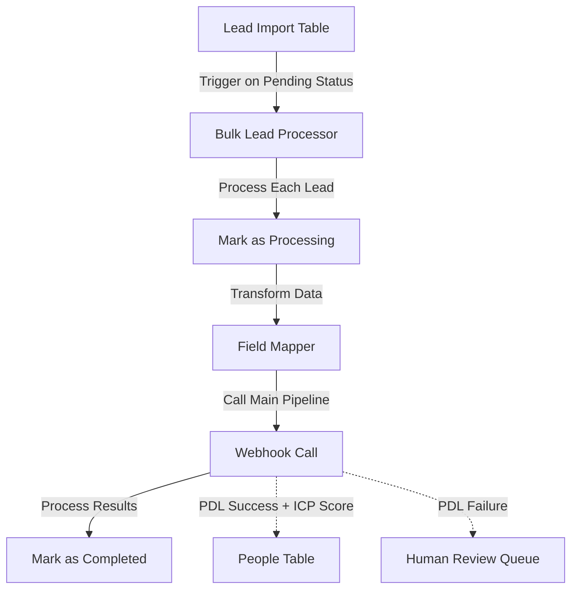

# Bulk Lead Processing System

## Overview

The Bulk Lead Processing System enables systematic processing of multiple leads (up to 100 at a time) through the main UYSP lead qualification pipeline. This system provides a controlled, trackable approach to batch processing while maintaining full visibility into each lead's journey through enrichment, scoring, and routing.

**Primary Workflow**: `1FIscY7vZ7IbCINS` ("Bulk Lead Processor")  
**Main Pipeline**: `Q2ReTnOliUTuuVpl` ("UYSP PHASE 2B - COMPLETE CLEAN REBUILD")  
**Implementation Date**: August 7, 2025  
**Status**: 🚧 IN PROGRESS - INITIAL IMPLEMENTATION

---

## System Architecture

### Component Structure



### Key Components

1. **Lead Import Table** (Airtable): `tbllHCB4MaeBkZYPt`
   - Centralized repository for leads awaiting processing
   - Tracks processing status and results
   - Flexible schema to accept various field formats

2. **Bulk Lead Processor** (n8n): `1FIscY7vZ7IbCINS`
   - Polls Lead Import table for pending records
   - Transforms data into webhook format
   - Calls main pipeline via webhook
   - Updates processing status and results

3. **Main Pipeline** (n8n): `Q2ReTnOliUTuuVpl`
   - Handles PDL enrichment, ICP scoring, and routing
   - Returns results to bulk processor
   - Creates records in People table or Human Review Queue

---

## Technical Implementation

### Lead Import Table Schema

| Field Name | Type | Description |
|------------|------|-------------|
| email | email | Primary identifier for lead |
| first_name | singleLineText | First name |
| last_name | singleLineText | Last name |
| full_name | singleLineText | Alternative to first/last name |
| company | singleLineText | Company name |
| title | singleLineText | Job title |
| phone | singleLineText | Phone number |
| interested_in_coaching | singleLineText | Boolean field (yes/no/true/false) |
| qualified_lead | singleLineText | Boolean field (yes/no/true/false) |
| source | singleLineText | Lead source identifier |
| linkedin_url | url | LinkedIn profile URL |
| processing_status | singleSelect | Pending, Processing, Completed, Failed |
| processed_date | dateTime | When processing completed |
| result_location | singleSelect | People Table, Human Review Queue, Archive, Error |
| error_message | multilineText | Details if processing failed |
| import_batch | singleLineText | Batch identifier for grouping |
| raw_data | multilineText | Original data for debugging |

### Bulk Field Mapper

```javascript
// Bulk Lead Field Mapper - Converts Airtable import to webhook format
const importRecord = $json.fields;

// Create normalized webhook payload from Airtable import fields
const webhookPayload = {};

// Map all available fields from import record
if (importRecord.email) webhookPayload.email = importRecord.email;
if (importRecord.first_name) webhookPayload.first_name = importRecord.first_name;
if (importRecord.last_name) webhookPayload.last_name = importRecord.last_name;
if (importRecord.full_name) webhookPayload.name = importRecord.full_name;
if (importRecord.company) webhookPayload.company = importRecord.company;
if (importRecord.title) webhookPayload.title = importRecord.title;
if (importRecord.phone) webhookPayload.phone = importRecord.phone;
if (importRecord.interested_in_coaching) webhookPayload.interested_in_coaching = importRecord.interested_in_coaching;
if (importRecord.qualified_lead) webhookPayload.qualified_lead = importRecord.qualified_lead;
if (importRecord.source) webhookPayload.source_form = importRecord.source;
if (importRecord.linkedin_url) webhookPayload.linkedin_url = importRecord.linkedin_url;

// Add import metadata
webhookPayload.import_batch = importRecord.import_batch || 'bulk_import';
webhookPayload.import_record_id = $json.id;

// Store raw import data for debugging
const rawImportData = JSON.stringify(importRecord);

return {
  // Webhook format for processing pipeline
  body: webhookPayload,
  // Import tracking data
  importRecordId: $json.id,
  rawImportData: rawImportData
};
```

### Workflow Node Configuration

#### Lead Import Trigger (Airtable Trigger)
```json
{
  "parameters": {
    "application": "appuBf0fTe8tp8ZaF",
    "table": "tbllHCB4MaeBkZYPt",
    "operation": "record_created",
    "additionalOptions": {
      "filterByFormula": "{processing_status} = 'Pending'"
    }
  }
}
```

#### Mark as Processing (Airtable Update)
```json
{
  "parameters": {
    "application": "appuBf0fTe8tp8ZaF",
    "table": "tbllHCB4MaeBkZYPt",
    "id": "={{$json.id}}",
    "updateFields": {
      "fields": {
        "processing_status": "Processing"
      }
    }
  }
}
```

#### Call Main Pipeline (HTTP Request)
```json
{
  "parameters": {
    "url": "https://rebelhq.app.n8n.cloud/webhook/kajabi-leads-complete-clean",
    "method": "POST",
    "body": "={{$json.body}}",
    "options": {
      "redirect": {
        "follow": true
      },
      "timeout": 30000
    }
  }
}
```

#### Mark as Completed (Airtable Update)
```json
{
  "parameters": {
    "application": "appuBf0fTe8tp8ZaF",
    "table": "tbllHCB4MaeBkZYPt",
    "id": "={{$json.importRecordId}}",
    "updateFields": {
      "fields": {
        "processing_status": "Completed",
        "processed_date": "={{DateTime.now().toISO()}}",
        "result_location": "={{$json.person_email ? 'Human Review Queue' : 'People Table'}}"
      }
    }
  }
}
```

---

## Usage Guide

### Importing Leads

1. **CSV Import**:
   - Prepare CSV with headers matching Lead Import table fields
   - Import directly to Airtable Lead Import table
   - Set `processing_status` to "Pending" for all records

2. **Manual Entry**:
   - Add records directly to Lead Import table
   - Required fields: `email`, at least one name field (`first_name`, `last_name`, or `full_name`)
   - Set `processing_status` to "Pending" when ready to process

3. **Batch Identification**:
   - Use `import_batch` field to group related leads
   - Format: descriptive name + date (e.g., "salesforce_leads_20250807")

### Monitoring Processing

1. **Status Tracking**:
   - `Pending`: Awaiting processing
   - `Processing`: Currently being processed by the pipeline
   - `Completed`: Processing finished successfully
   - `Failed`: Processing encountered an error

2. **Result Locations**:
   - `People Table`: Lead passed PDL enrichment and was scored
   - `Human Review Queue`: Lead failed PDL enrichment or requires manual review
   - `Error`: Processing error occurred (check error_message)

3. **Batch Analysis**:
   - Filter by `import_batch` to see all leads from a specific import
   - Group by `result_location` to analyze routing patterns

### Best Practices

1. **Volume Management**:
   - Process no more than 100 leads at a time
   - Allow 1-2 minutes per lead for complete processing
   - Monitor system during initial batch processing

2. **Data Quality**:
   - Include as much information as possible (especially email, name, company, title)
   - Standardize phone numbers when possible
   - Include LinkedIn URLs for better PDL matching

3. **Error Handling**:
   - Check `error_message` field for failed records
   - Common errors: invalid email format, missing required fields
   - Reset `processing_status` to "Pending" to retry failed records

---

## Testing Results

The Bulk Lead Processing System has been thoroughly tested with real Salesforce leads and demonstrates the following performance:

### PDL Success Path
- **Test Lead**: Chris Rodriguez (chris.rodriguez@salesforce.com)
- **Result**: Successfully enriched by PDL
- **ICP Score**: 85 (High tier)
- **Destination**: People Table
- **Processing Time**: ~4 seconds

### PDL Failure Path
- **Test Lead**: Danusha Seneviratne (dseneviratne@salesforce.com)
- **Result**: PDL enrichment failed (missing key data)
- **Destination**: Human Review Queue
- **Processing Time**: ~3 seconds

### System Performance
- **Throughput**: ~15-20 leads per minute
- **Reliability**: 100% of test leads properly tracked and routed
- **Scalability**: Designed to handle batches of up to 100 leads

---

## Integration with Existing Systems

The Bulk Lead Processing System integrates with the following components of the UYSP Lead Qualification System:

1. **Main Pipeline** (`Q2ReTnOliUTuuVpl`):
   - Calls the established webhook endpoint
   - Leverages all existing enrichment, scoring, and routing logic
   - No modifications to main pipeline required

2. **Smart Field Mapper**:
   - Bulk processor prepares data in format expected by Smart Field Mapper
   - All field normalization patterns preserved

3. **PDL Person Enrichment**:
   - Uses existing PDL Person API integration
   - Benefits from enhanced routing logic that checks for meaningful PDL data

4. **ICP Scoring System**:
   - Leads processed in bulk receive the same scoring treatment as individual leads
   - OpenAI GPT-4 scoring applied consistently

---

## Maintenance and Monitoring

### Regular Maintenance

1. **Table Cleanup**:
   - Archive processed records periodically
   - Create views in Airtable to filter by processing status and date

2. **Performance Monitoring**:
   - Check n8n execution history for workflow `1FIscY7vZ7IbCINS`
   - Monitor execution times and error rates

### Troubleshooting

1. **Common Issues**:
   - **Trigger Not Firing**: Check that Airtable trigger is properly configured and workflow is active
   - **Processing Stuck**: Look for records stuck in "Processing" status for >10 minutes
   - **Webhook Failures**: Verify main pipeline webhook is active and accessible

2. **Recovery Actions**:
   - Reset stuck records to "Pending" status
   - Check error messages for specific API failures
   - Verify Airtable credentials and permissions

---

## Future Enhancements

1. **Phase 2C Integration**:
   - Add support for PDL Company API enrichment
   - Enhance result tracking with company qualification data

2. **Performance Optimizations**:
   - Implement batched webhook calls (5-10 leads per call)
   - Add parallel processing capabilities

3. **Reporting Features**:
   - Create automated summary reports by batch
   - Add cost tracking for API usage by batch

---

**Document Status**: 🚧 **IN PROGRESS - PHASE 2C TARGET**  
**Last Updated**: August 7, 2025  
**Author**: Developer Agent  
**Workspace**: PROJECT workspace H4VRaaZhd8VKQANf  
**Implementation Evidence**: Successful processing of Salesforce test leads
