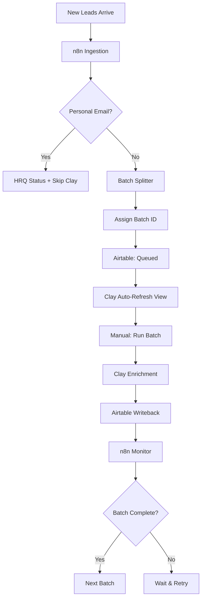

# Clay Batching & Automation Plan

**Status**: Documented for Future Implementation
**Created**: 2025-01-27
**Current Approach**: Option A (Quick Ship)
**Future Approach**: Option B (Semi-Automated)

## Current State (Option A - In Production Now)

### What We're Doing Today
1. **Manual Clay batches** of 200-500 leads
2. **Personal email pre-filter** in n8n (30 min setup)
3. **Simple monitoring** via Slack notifications
4. **Phone normalization** in Clay (see below)

### Phone Number Handling
**SimpleTexting Requirements**: 10-digit format (e.g., `3051234567`)
- No country code
- No formatting characters
- Just digits

**Clay Phone Normalization Setup**:
1. Add enrichment: "Format Phone Number"
2. Input: `/phone`
3. Country: US
4. Output format: National (10 digits)
5. Also validates the number
6. Creates columns:
   - `phone_normalized` (10 digits for SimpleTexting)
   - `phone_valid` (true/false)
   - `phone_e164` (+1 format if needed later)

**Airtable Writeback**:
- Map `phone_normalized` → Phone field
- Map `phone_valid` → Phone Valid checkbox

---

## Option B: Semi-Automated (Next Week Implementation)

### Overview
Automate batching and monitoring while keeping Clay's manual "Run" requirement. This balances automation with simplicity.

### Architecture



### Components

#### 1. n8n Personal Email Filter (30 min)
```javascript
// Personal email domains to filter
const personalDomains = [
  'gmail.com', 'yahoo.com', 'hotmail.com', 'outlook.com',
  'icloud.com', 'aol.com', 'proton.me', 'protonmail.com',
  'msn.com', 'live.com', 'me.com', 'mac.com',
  'yandex.com', 'gmx.com', 'zoho.com', 'mail.com',
  'fastmail.com', 'pm.me'
];

// Extract domain from email
const email = $json.email.toLowerCase();
const domain = email.split('@')[1];

// Check if personal
if (personalDomains.includes(domain)) {
  // Route to HRQ
  $json.processing_status = 'HRQ';
  $json.hrq_reason = 'Personal email domain';
  $json.skip_enrichment = true;
} else {
  // Continue to enrichment
  $json.processing_status = 'Queued';
  $json.skip_enrichment = false;
}

return $json;
```

#### 2. n8n Batch Splitter (1 hour)
**Workflow**: "Lead Batch Orchestrator"
- **Trigger**: Daily at 9am ET or manual
- **Steps**:
  1. Get Airtable records where `Processing Status = Backlog`
  2. Split into chunks of 200
  3. For each chunk:
     - Generate `Batch ID` (e.g., "2025-01-27-001")
     - Update records with Batch ID
     - Set `Processing Status = Queued`
  4. Send Slack notification: "Batch {ID} ready for Clay (200 leads)"

#### 3. Clay Configuration (Already Done)
- **Source**: Airtable view "Clay Queue"
  - Filter: `Processing Status = Queued AND Batch ID = {current}`
- **Auto-refresh**: Every 30 minutes
- **Manual step**: Click "Run all" when ready

#### 4. n8n Batch Monitor (30 min)
**Workflow**: "Clay Batch Monitor"
- **Trigger**: Every 30 minutes
- **Steps**:
  1. Count records by Processing Status and Batch ID
  2. If batch complete (all Enriched or Failed):
     - Send completion metrics to Slack
     - Trigger next batch if available
  3. If stalled (no progress in 1 hour):
     - Alert via Slack

#### 5. n8n Writeback Helper (Optional - 2 hours)
**Only if Clay writeback continues to fail**
- Pull enriched data from Clay API
- Write to Airtable with rate limiting (3 req/sec)
- Exponential backoff on 429 errors
- Log all failures for manual review

### Airtable Schema Additions

```javascript
// Already added:
- Batch ID (Single line text)

// To add for Option B:
- Batch Started At (Date/time)
- Batch Completed At (Date/time)
- Enrichment Attempts (Number)
- Last Error (Long text)
```

### Monitoring & Metrics

**Slack Notifications**:
```
✅ Batch 2025-01-27-001 Complete
- Total: 200 leads
- Enriched: 195 (97.5%)
- Failed: 3 (1.5%)
- Personal emails: 2 (1%)
- Duration: 45 minutes
- Cost estimate: $6.00

Next batch ready: 2025-01-27-002 (200 leads)
```

### Cost Optimization
- Personal email filtering saves ~5% of enrichment costs
- Batch processing allows credit monitoring
- Failed enrichments tracked for pattern analysis

### Rollout Plan

**Week 1 (Current)**:
- ✅ Option A: Manual batching with monitoring
- ✅ Personal email list defined
- ✅ Phone normalization configured

**Week 2 (Next)**:
1. Day 1: Build personal email filter
2. Day 2: Build batch orchestrator
3. Day 3: Test with 50-lead batch
4. Day 4: Build monitoring workflow
5. Day 5: Production rollout

### Success Metrics
- 500+ leads/day throughput
- <5% manual intervention required
- <2% enrichment failure rate
- 100% phone validation before SMS

### Fallback Plan
If Option B has issues, revert to Option A immediately. All Option B components are additive and can be disabled without affecting core enrichment.

---

## Phone Normalization Details

### Clay Configuration
1. **Add Column** → **Add Enrichment**
2. Search: "Format Phone Number" or "Normalize Phone"
3. **Configure**:
   ```
   Input: /phone
   Country: United States
   Output Format: National (###) ###-#### 
   Also output: E.164 format
   Validate: Yes
   ```

4. **Extract Fields**:
   - `phone_national` → "3051234567" (10 digits)
   - `phone_e164` → "+13051234567" 
   - `phone_valid` → true/false
   - `phone_type` → "mobile"/"landline"

### Airtable Mapping
```yaml
Clay → Airtable:
- phone_national → Phone (for SimpleTexting)
- phone_valid → Phone Valid (checkbox)
- phone_type → Phone Type (single select)
- phone_e164 → Phone E164 (backup field)
```

### SimpleTexting Format
**Required**: 10-digit format
```javascript
// Good for SimpleTexting
"3051234567"  ✅

// Bad for SimpleTexting  
"+13051234567"  ❌ (has country code)
"305-123-4567"  ❌ (has formatting)
"(305) 123-4567" ❌ (has formatting)
```

### Validation Rules
1. Must be exactly 10 digits
2. Must be valid US/Canada number
3. Prefer mobile over landline for SMS
4. Store validation status for filtering

---

## Decision Log

**2025-01-27**: Chose Option A for immediate deployment
- Reason: Urgent need to process leads
- Timeline: Ship today vs next week
- Risk: Low with manual process
- Plan: Upgrade to Option B after validation

**Phone Format Decision**:
- SimpleTexting requires 10-digit format
- Clay can normalize and validate
- Store multiple formats for flexibility
- E.164 kept for future integrations

---

## HRQ Routing (Personal Emails)
- Source: Clay “Identify Email Type…” enrichment
- Rule: If `IsLikelyPersonalEmail = true` → set `HRQ Status = Archive`, `HRQ Reason = Personal email`, skip enrichment/writeback except HRQ fields.

## Status Checklist

Done:
- Company dedupe and enrichment (Apollo + GPT)
- Join back to Raw Leads and field extraction
- Airtable writeback for company/person core fields
- Phone normalization (Significant, Successfully Parsed)
- ICP Score formula finalized (+5 Prime Fit Bonus)
- Job Title field added
- Batch ID field added

Pending (Option A next steps):
- HRQ routing enforced in Clay mapping (exclude personal emails)
- n8n Personal Email Filter (optional prefilter)
- SMS Eligible (calc) field and view wired
- A/B testing fields and guide

Planned (Option B):
- Batch Orchestrator workflow
- Batch Monitor workflow
- Optional Writeback Helper
