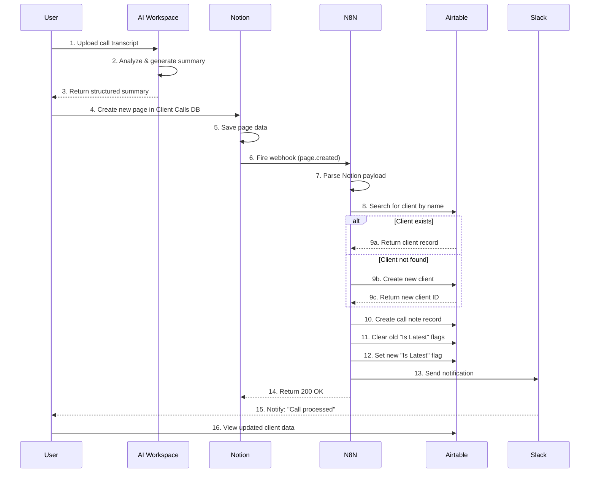

# Client Call Transcript System - Complete Architecture

## Overview

This document describes the complete architecture for automated client call transcript processing, from capture through analysis, storage, and dashboard presentation.

---

## System Components

```
┌─────────────────────────────────────────────────────────────────────┐
│                        USER WORKSPACE                                │
│  ┌───────────────────────────────────────────────────────────────┐  │
│  │  1. Client Call → Transcript Folder → AI Analysis             │  │
│  │     (Current Manual Process - Already Working)                │  │
│  └───────────────────────────────────────────────────────────────┘  │
└──────────────────────────────┬──────────────────────────────────────┘
                               │ Generated Summary
                               ▼
┌─────────────────────────────────────────────────────────────────────┐
│                           NOTION                                     │
│  ┌───────────────────────────────────────────────────────────────┐  │
│  │  Client Calls Database                                         │  │
│  │  - Client Name (Title)                                         │  │
│  │  - Call Date                                                   │  │
│  │  - Executive Summary                                           │  │
│  │  - Top Priorities, Decisions, Blockers, Next Steps            │  │
│  │  - Attendees, Recording URL, Transcript                        │  │
│  └───────────────────────────────────────────────────────────────┘  │
│                               │                                      │
│                               │ Webhook on Create                    │
└───────────────────────────────┼──────────────────────────────────────┘
                                ▼
┌─────────────────────────────────────────────────────────────────────┐
│                             N8N                                      │
│  ┌───────────────────────────────────────────────────────────────┐  │
│  │  Workflow: UYSP-Client-Call-Ingestion                         │  │
│  │                                                                │  │
│  │  1. Receive webhook from Notion                               │  │
│  │  2. Parse call data                                            │  │
│  │  3. Find/Create client in Airtable                            │  │
│  │  4. Create call note record                                    │  │
│  │  5. Update "Is Latest" flags                                   │  │
│  │  6. Send Slack notification                                    │  │
│  └───────────────────────────────────────────────────────────────┘  │
└───────────────────────────────┼──────────────────────────────────────┘
                                ▼
┌─────────────────────────────────────────────────────────────────────┐
│                          AIRTABLE                                    │
│  ┌──────────────────────────────┐  ┌────────────────────────────┐  │
│  │  Clients Table               │  │  Client_Call_Notes Table   │  │
│  │  - Client Name               │  │  - Client (link)           │  │
│  │  - Status                    │◄─┤  - Call Date               │  │
│  │  - Industry                  │  │  - Executive Summary       │  │
│  │  - Total Calls (rollup)      │  │  - Top Priorities          │  │
│  │  - Latest Call Date (lookup) │  │  - Key Decisions           │  │
│  └──────────────────────────────┘  │  - Blockers                │  │
│                                     │  - Next Steps              │  │
│                                     │  - Attendees               │  │
│                                     │  - Is Latest (checkbox)    │  │
│                                     │  - Notion Page ID          │  │
│                                     └────────────────────────────┘  │
└───────────────────────────────┼──────────────────────────────────────┘
                                ▼
┌─────────────────────────────────────────────────────────────────────┐
│                    DASHBOARDS / INTEGRATIONS                         │
│  - Client Portal (Latest Call Summary Widget)                       │
│  - Slack Notifications                                               │
│  - Reports & Analytics                                               │
└─────────────────────────────────────────────────────────────────────┘
```

---

## Data Flow Diagram



---

## Airtable Schema Design

### Table 1: `Clients`

**Purpose:** Central registry of all clients with aggregated call intelligence

| Field Name | Type | Configuration | Purpose |
|------------|------|---------------|---------|
| Client ID | Formula | `RECORD_ID()` | Unique identifier |
| Client Name | Single Line Text | Primary field | Client company name |
| Status | Single Select | Options: Active, Inactive, Prospect, Churned | Current relationship status |
| Industry | Single Line Text | | Business sector |
| Company Size | Single Select | Options: Small (<50), Medium (50-500), Large (500-5000), Enterprise (5000+) | Company scale |
| Primary Contact Name | Single Line Text | | Main point of contact |
| Primary Contact Email | Email | | Contact email |
| Primary Contact Phone | Phone | | Contact phone |
| First Contact Date | Date | | Date of first engagement |
| Source | Single Select | Options: Referral, Direct, Call Notes, Kajabi, Other | How client was acquired |
| Website | URL | | Company website |
| Notes | Long Text | | General notes about client |
| **Call Metrics** | | | |
| Total Calls | Rollup | Count from Client_Call_Notes | Number of calls logged |
| Latest Call Date | Lookup | From Client_Call_Notes where Is Latest = true | Most recent call date |
| Latest Call Summary | Lookup | From Client_Call_Notes where Is Latest = true | Most recent executive summary |
| Days Since Last Call | Formula | `DATETIME_DIFF(TODAY(), {Latest Call Date}, 'days')` | Engagement freshness |
| Call Frequency | Formula | `IF({Total Calls} > 1, DATETIME_DIFF(TODAY(), {First Contact Date}, 'days') / {Total Calls}, 0)` | Average days between calls |
| **Flags** | | | |
| Active Client | Checkbox | | Currently engaged |
| High Priority | Checkbox | | Requires special attention |
| At Risk | Formula | `{Days Since Last Call} > 45` | No recent contact |
| **Timestamps** | | | |
| Created At | Created Time | | Record creation |
| Updated At | Last Modified Time | | Last update |

**Views:**
1. **Active Clients** - Status = "Active", sorted by Latest Call Date
2. **At Risk** - At Risk = true, sorted by Days Since Last Call (desc)
3. **High Priority** - High Priority = true
4. **Recent Calls (7 days)** - Latest Call Date >= TODAY()-7
5. **All Clients** - All records, sorted by Client Name

---

### Table 2: `Client_Call_Notes`

**Purpose:** Detailed records of every client call with full context

| Field Name | Type | Configuration | Purpose |
|------------|------|---------------|---------|
| Note ID | Formula | `RECORD_ID()` | Unique identifier |
| Title | Formula | `{Client Name} & " - " & DATETIME_FORMAT({Call Date}, 'MMM DD, YYYY')` | Auto-generated title |
| **Core Data** | | | |
| Client | Link to Clients | Required | Link to client record |
| Client Name | Lookup | From Client | Display client name |
| Call Date | Date | Required | When call occurred |
| Attendees | Single Line Text | | Who was on the call |
| Call Duration | Number | | Minutes (optional) |
| Call Type | Single Select | Options: Status Update, Planning, Retrospective, Kick-off, Emergency, Other | Call category |
| **Call Content** | | | |
| Executive Summary | Long Text | Required | 2-3 paragraph overview |
| Top Priorities | Long Text | | Bulleted list of priorities |
| Key Decisions | Long Text | | Important decisions made |
| Blockers Discussed | Long Text | | Current blockers |
| Next Steps | Long Text | | Action items |
| **Media** | | | |
| Call Recording URL | URL | | Link to recording |
| Full Transcript | Long Text | | Complete transcript |
| **Metadata** | | | |
| Notion Page ID | Single Line Text | | Reference to source page |
| Is Latest | Checkbox | | Mark most recent per client |
| **Sentiment Analysis** (Future) | | | |
| Client Sentiment | Single Select | Options: Very Positive, Positive, Neutral, Negative, Very Negative | Overall tone |
| Blocker Count | Formula | Count items in Blockers | Number of blockers |
| Action Item Count | Formula | Count items in Next Steps | Number of action items |
| **Timestamps** | | | |
| Created At | Created Time | | When note was created |
| Updated At | Last Modified Time | | Last modification |
| Processed At | Single Line Text | | When n8n processed it |

**Views:**
1. **All Calls** - All records, sorted by Call Date (desc)
2. **Latest Calls Only** - Is Latest = true, grouped by Client
3. **By Client** - Grouped by Client, sorted by Call Date (desc)
4. **Recent (7 Days)** - Call Date >= TODAY()-7
5. **By Type** - Grouped by Call Type
6. **With Blockers** - Blockers Discussed is not empty
7. **Needs Follow-up** - Next Steps is not empty, sorted by Call Date

**Automations:**
1. **Send Email Digest** - When new call note created, send email to team
2. **Update Client Status** - When call note created, set Client.Active = true
3. **Flag Old Notes** - Daily automation to uncheck Is Latest for notes >90 days old (optional)

---

## Notion Database Configuration

### Database: "Client Calls"

**Location:** Create in your main Notion workspace, ideally in a "Client Management" section

**Properties:**

| Property Name | Type | Configuration |
|---------------|------|---------------|
| Client Name | Title | Primary property |
| Call Date | Date | Include time: No |
| Executive Summary | Text | Allow line breaks |
| Top Priorities | Text | Allow line breaks |
| Key Decisions | Text | Allow line breaks |
| Blockers | Text | Allow line breaks |
| Next Steps | Text | Allow line breaks |
| Attendees | Text | Single line |
| Call Recording URL | URL | |
| Full Transcript | Text | Allow line breaks (or use separate page) |
| Status | Select | Options: Draft, Processed, Synced |
| Synced to Airtable | Checkbox | Manual confirmation |

**Template:**
Create a default template with pre-filled structure:

```markdown
## Executive Summary
[2-3 paragraph overview of the call]

## Top Priorities
- Priority 1
- Priority 2
- Priority 3

## Key Decisions
- Decision 1
- Decision 2

## Blockers Discussed
- Blocker 1 (Owner: [Name], Due: [Date])
- Blocker 2

## Next Steps
- [ ] Action item 1 (Owner: [Name], Due: [Date])
- [ ] Action item 2
- [ ] Action item 3

## Attendees
[Names]

## Additional Notes
[Any other relevant context]
```

---

## n8n Workflow Configuration

### Workflow Name: `UYSP-Client-Call-Ingestion`

**Trigger:** Webhook  
**Path:** `/webhook/client-call`  
**Method:** POST  
**Authentication:** None (Notion webhook token validated in code)

**Environment Variables Required:**
```env
AIRTABLE_API_KEY=your_airtable_api_key
AIRTABLE_BASE_ID=your_base_id
NOTION_API_KEY=your_notion_integration_token
SLACK_WEBHOOK_URL=your_slack_webhook_url
```

**Node Configuration:**

1. **Webhook** (Trigger)
   - HTTP Method: POST
   - Path: `/webhook/client-call`
   - Respond: Immediately
   - Response Code: 200

2. **Parse Notion Data** (Function)
   - Language: JavaScript
   - See SOP for full code

3. **Find Client** (Airtable)
   - Operation: Search
   - Table: Clients
   - Formula: `SEARCH(LOWER("{{$json.clientName}}"), LOWER({Client Name})) > 0`
   - Return fields: Client ID, Client Name

4. **Client Exists?** (IF)
   - Condition: `{{$json.recordsFound}} > 0`
   - Output True: Existing client flow
   - Output False: Create new client flow

5. **Create New Client** (Airtable - False branch)
   - Operation: Create
   - Table: Clients
   - Fields: Client Name, Status=Active, Source=Call Notes

6. **Merge Client Data** (Merge)
   - Merge both branches back together
   - Ensure clientId is available for next node

7. **Create Call Note** (Airtable)
   - Operation: Create
   - Table: Client_Call_Notes
   - Fields: All call data + Client link

8. **Clear Old 'Is Latest' Flags** (Airtable)
   - Operation: Search + Update
   - Find all Is Latest=true for this client (excluding new record)
   - Set Is Latest=false

9. **Send Slack Notification** (Slack)
   - Channel: #client-updates
   - Message: Formatted notification

10. **Respond** (Function)
    - Return success JSON

---

## Integration Points

### 1. Workspace → Notion
**Method:** Manual copy-paste (for now)

**Future Enhancement:** Direct API integration
- Workspace AI generates summary
- Automatically posts to Notion via API
- Returns confirmation to user

### 2. Notion → n8n
**Method:** Webhook

**Setup:**
1. Create Notion integration at https://www.notion.so/my-integrations
2. Add integration to "Client Calls" database
3. Use Notion API to create webhook subscription:

```bash
curl -X POST https://api.notion.com/v1/webhooks \
  -H 'Authorization: Bearer YOUR_NOTION_TOKEN' \
  -H 'Content-Type: application/json' \
  -H 'Notion-Version: 2022-06-28' \
  -d '{
    "event_types": ["page.created"],
    "database_id": "YOUR_DATABASE_ID",
    "url": "https://your-n8n-instance.com/webhook/client-call"
  }'
```

### 3. n8n → Airtable
**Method:** Airtable API via n8n nodes

**Authentication:**
- API Key stored in n8n credentials
- Base ID stored as environment variable

### 4. n8n → Slack
**Method:** Incoming Webhook

**Setup:**
1. Create Slack app
2. Enable Incoming Webhooks
3. Add webhook URL to n8n credentials
4. Select target channel

---

## Security Considerations

### API Keys & Secrets
- ✅ Store in n8n credentials manager (encrypted)
- ✅ Never commit to git
- ✅ Rotate quarterly
- ✅ Use read-only keys where possible

### Webhook Security
- ⚠️ Notion webhooks include signature verification
- ✅ Validate incoming payload structure
- ✅ Rate limiting on n8n webhook endpoint
- ✅ Log all webhook calls for audit

### Data Privacy
- ⚠️ Call transcripts may contain sensitive information
- ✅ Restrict Airtable access to authorized personnel
- ✅ Notion workspace should have proper permissions
- ✅ Consider GDPR/privacy regulations for transcript storage

### Access Control
- Notion: Limit integration to specific database
- Airtable: Use scoped API keys (not full access)
- n8n: Restrict workflow editing to admins
- Slack: Use private channel for notifications

---

## Monitoring & Observability

### Key Metrics to Track

1. **Workflow Health**
   - Success rate (target: >99%)
   - Average execution time (target: <5 seconds)
   - Failed executions per week (target: <1)

2. **Data Quality**
   - Calls with missing summaries (target: 0%)
   - Client matching accuracy (target: >95%)
   - Duplicate client creation rate (target: <1%)

3. **User Adoption**
   - Calls logged per week
   - Average time from call to Notion entry
   - % of calls with complete data

### Monitoring Setup

**n8n:**
- Enable execution logging
- Set up email alerts for failures
- Monitor webhook response times

**Airtable:**
- Create "Data Quality" view
- Flag incomplete records
- Monitor duplicate entries

**Slack:**
- Create #system-alerts channel
- Send critical errors here
- Weekly digest of metrics

### Alerting Rules

| Alert | Condition | Severity | Action |
|-------|-----------|----------|--------|
| Workflow Failure | Execution failed | High | Immediate notification |
| No Calls in 7 Days | No new records | Low | Weekly check-in |
| Client Mismatch | New client created for known name | Medium | Review and merge |
| Incomplete Data | Summary < 50 chars | Low | Request user to update |
| Webhook Down | No executions in 24h | Critical | Check Notion integration |

---

## Maintenance & Support

### Weekly Tasks
- [ ] Review failed executions
- [ ] Check for duplicate clients
- [ ] Validate "Is Latest" flags
- [ ] Verify Slack notifications sent

### Monthly Tasks
- [ ] Analyze usage metrics
- [ ] Review data quality reports
- [ ] Update client name mappings
- [ ] Test end-to-end workflow
- [ ] Rotate API keys (quarterly)

### Quarterly Tasks
- [ ] Comprehensive data audit
- [ ] User feedback session
- [ ] Performance optimization
- [ ] Feature enhancement planning

---

## Rollback Plan

If system needs to be disabled:

1. **Immediate Actions:**
   - Deactivate n8n workflow
   - Disable Notion webhook
   - Notify users of temporary manual process

2. **Data Preservation:**
   - All Notion data remains intact
   - All Airtable data preserved
   - No data loss risk

3. **Manual Fallback:**
   - Users copy-paste directly to Airtable
   - Same fields, same structure
   - Loss of automation only

4. **Re-activation:**
   - Fix identified issues
   - Test with sample data
   - Re-enable webhook
   - Activate workflow
   - Monitor closely for 48 hours

---

## Success Criteria

### Phase 1: MVP (Week 1-2)
- ✅ Notion database created
- ✅ Airtable tables created
- ✅ n8n workflow deployed
- ✅ End-to-end test successful
- ✅ First real call processed

### Phase 2: Stabilization (Week 3-4)
- ✅ 10+ calls processed without errors
- ✅ User feedback collected
- ✅ Bug fixes completed
- ✅ Documentation finalized
- ✅ Team trained

### Phase 3: Optimization (Month 2)
- ✅ Average processing time <3 seconds
- ✅ Zero manual interventions needed
- ✅ 100% user adoption
- ✅ Data quality >98%
- ✅ Consider enhancements

---

## Cost Analysis

### Platform Costs

| Platform | Current Plan | Additional Cost | Notes |
|----------|-------------|-----------------|-------|
| Notion | Team Plan | $0 | Within existing limits |
| Airtable | Pro Plan | $0 | <50,000 records |
| n8n | Cloud Starter | $0 | <5,000 executions/month |
| Slack | Free | $0 | Webhook only |

**Estimated Executions:** 80-100/month (20 calls × 1-2 retries)  
**Total Additional Monthly Cost:** $0

### Time Savings

**Before Automation:**
- Time per call: 5-10 minutes (manual data entry)
- 20 calls/month = 100-200 minutes/month
- **Cost:** ~3-4 hours/month manual labor

**After Automation:**
- Time per call: 30 seconds (paste to Notion)
- 20 calls/month = 10 minutes/month
- **Savings:** ~3.5 hours/month

**ROI:** Immediate positive - automation costs $0, saves 3-4 hours/month

---

## Future Roadmap

### Q1 2026: Enhanced Intelligence
- [ ] AI sentiment analysis on transcripts
- [ ] Automatic action item extraction & assignment
- [ ] Client health scoring based on call patterns
- [ ] Predictive analytics (churn risk, upsell opportunities)

### Q2 2026: Deeper Integrations
- [ ] Direct workspace → Notion API (eliminate copy-paste)
- [ ] CRM integration (HubSpot/Salesforce sync)
- [ ] Calendar integration (auto-schedule follow-ups)
- [ ] Email automation (send follow-up summaries)

### Q3 2026: Advanced Features
- [ ] Voice-to-text direct upload
- [ ] Real-time transcription during calls
- [ ] AI meeting assistant (auto-join, record, summarize)
- [ ] Multi-language support

### Q4 2026: Analytics & Reporting
- [ ] Executive dashboard (call trends, client health)
- [ ] Custom report builder
- [ ] Benchmark analysis (industry comparisons)
- [ ] Automated insights ("3 clients haven't been contacted in 60 days")

---

**Last Updated:** 2025-10-23  
**Version:** 1.0  
**Status:** Ready for Implementation  
**Owner:** UYSP Development Team

