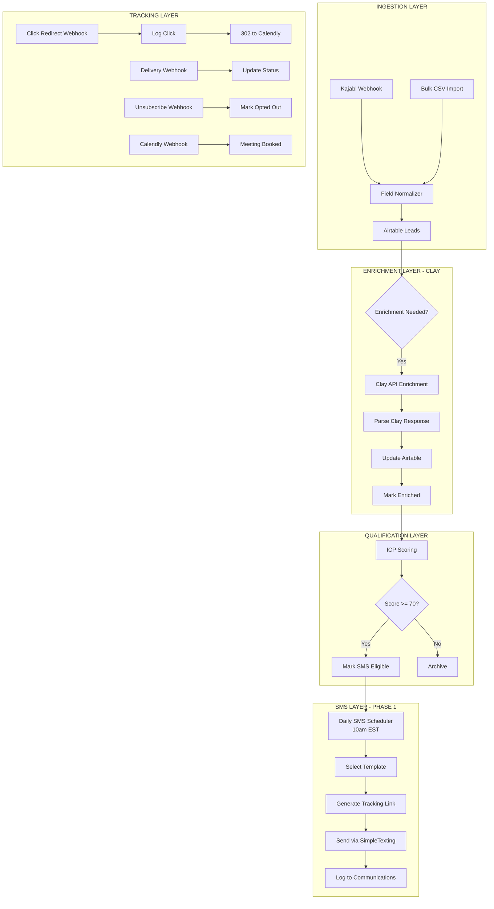

# SMS + Clay Enrichment System - Complete Wireframe
*Single message first, then sequences. Clay enrichment priority.*

## 🎯 CORE DECISIONS MADE

### Priority Order:
1. **NOW:** Clay enrichment + Single SMS with tracking
2. **NEXT:** 3-message sequences  
3. **LATER:** Reply handling, AI responses

### Key Architecture Choices (Finalized):
- ✅ **Click tracking via redirect proxy** `/c/:token` (critical for conversion metrics)
- ✅ **Templates in Airtable** with A/B testing capability
- ✅ **Campaign/batch tracking** for cohort analysis
- ✅ **Unsubscribe tracking** via SimpleTexting webhooks
- ✅ **Business hours enforcement** (9am-5pm EST)
- ✅ **Initial: "Do not reply"** messages (replies go nowhere)

## 📐 SYSTEM WIREFRAME



## 🗂️ AIRTABLE SCHEMA

### Leads Table (Enhanced):
```javascript
// EXISTING FIELDS
email, phone, first_name, last_name, company

// ENRICHMENT FIELDS (NEW)
clay_enriched: checkbox
clay_enriched_at: datetime
clay_job_title: text
clay_company_size: number
clay_company_industry: text
clay_linkedin_url: url
clay_technologies_used: multiselect
clay_revenue_range: text
clay_enrichment_cost: currency

// CAMPAIGN FIELDS (NEW)
lead_source: singleLineText // "Name – Type", e.g., "Kajabi – Webinar"
campaign_batch_id: singleLineText // e.g., "2025-09-kajabi-001"
sms_template_id: link to SMS_Templates
ab_test_variant: select ["A", "B", "Control"]

// SMS FIELDS (NEW)
sms_eligible: checkbox
sms_sent: checkbox
sms_sent_at: datetime
tracking_token: text (unique)
clicked_link: checkbox
clicked_at: datetime
meeting_booked: checkbox
opted_out: checkbox
```

### SMS_Templates Table (NEW):
```javascript
template_id: autonumber
template_name: text
template_type: select ["single", "sequence_1", "sequence_2", "sequence_3"]
message_text: long text
tracking_url_placeholder: text ("{{tracking_link}}")
active: checkbox
ab_variant: select ["A", "B", "Control"]
created: datetime
performance_metrics: rollup from Communications
```

### Communications Table (Enhanced):
```javascript
// EXISTING
person_id: link to Leads
message_type: "SMS"
sent_time: datetime

// NEW FIELDS
campaign_batch_id: text
template_id: link to SMS_Templates
ab_variant: text
simpletexting_message_id: text
tracking_token: text
clicked: checkbox
click_time: datetime
delivery_status: select ["pending", "delivered", "failed"]
carrier: text
unsubscribed: checkbox
unsubscribe_time: datetime
```

## 🔄 WORKFLOW COMPONENTS

### 1. Clay Enrichment Workflow
```javascript
// Workflow: UYSP-Clay-Enrichment
// Trigger: Every 5 minutes

// Node 1: Find Unenriched Leads
Airtable List: {
  clay_enriched: false,
  email: not empty
}
Limit: 10 per run

// Node 2: Call Clay API
POST https://api.clay.com/v1/enrich
{
  email: "{{email}}",
  company_domain: "{{company}}",
  data_points: ["title", "company_size", "technologies", "revenue"]
}

// Node 3: Parse Response
const clayData = $json;
return {
  clay_job_title: clayData.person?.title,
  clay_company_size: clayData.company?.employee_count,
  clay_technologies_used: clayData.company?.technologies,
  clay_revenue_range: clayData.company?.revenue_range,
  clay_linkedin_url: clayData.person?.linkedin_url,
  clay_enriched: true,
  clay_enriched_at: new Date(),
  clay_enrichment_cost: 0.10 // Track costs
};

// Node 4: Update Airtable
// Node 5: Calculate ICP Score
```

### 2. Click Tracking Redirect (Final)
```javascript
// Workflow: UYSP-Click-Tracker
// Path: /c/:token

// Node 1: Webhook Receive
const token = $params.token;

// Node 2: Find Lead by Token
Airtable Search: {
  tracking_token: token
}

// Node 3: Log Click
Airtable Update: {
  clicked_link: true,
  clicked_at: NOW()
}
Communications Update: {
  clicked: true,
  click_time: NOW()
}

// Node 4: Resolve Destination URL
// Pull destination from active template/variant or Campaign config

// Node 5: Redirect (302)
Response: {
  statusCode: 302,
  headers: {
    Location: "https://calendly.com/davidson/discovery"
  }
}
```

### 3. Single SMS Sender (Phase 1)
```javascript
// Workflow: UYSP-SMS-Single-Daily
// Schedule: 5 runs hourly from 10:00 AM ET (100 each)

// Node 1: Business Hours Check
if (isWeekend() || isHoliday() || !isBusinessHours()) {
  return; // Skip
}

// Node 2: Get Eligible Leads (Batch 100)
Airtable List: {
  sms_eligible: true,
  sms_sent: false,
  clay_enriched: true,
  opted_out: false
}
Limit: 100 // Per run

// Node 3: Assign Template & A/B Variant
// Randomly assign A or B template
const variant = Math.random() > 0.5 ? "A" : "B";
const template = getActiveTemplate(variant);

// Node 4: Generate Tracking Token
const token = generateUniqueToken();
const trackingUrl = `https://rebelhq.app.n8n.cloud/c/${token}`;

// Node 5: Personalize Message
const message = template.message_text
  .replace("{{first_name}}", lead.first_name)
  .replace("{{title}}", lead.clay_job_title)
  .replace("{{company}}", lead.company)
  .replace("{{tracking_link}}", trackingUrl);

// Node 6: Send via SimpleTexting
POST /api/messages
{
  contactPhone: lead.phone,
  text: message + "\n\nDo not reply. Text STOP to opt out.",
  mode: "SINGLE"
}

// Node 7: Log Everything
Airtable Updates:
- Lead: sms_sent=true, tracking_token, template_id, ab_variant
- Communications: Create record with all details
```

### 4. Webhook Handlers
```javascript
// A. Delivery Confirmation
Path: /webhook/simpletexting-delivery
Updates: Communications.delivery_status

// B. Unsubscribe Handler  
Path: /webhook/simpletexting-unsubscribe
Updates: Leads.opted_out = true
Stats: Track unsubscribe rate by template variant

// C. Calendly Meeting Booked
Path: /webhook/calendly
Updates: Leads.meeting_booked = true
Success: This is our WIN condition
```

## 📊 METRICS & REPORTING

### Critical Metrics:
```javascript
Funnel Analysis:
1. Leads Enriched (Clay)
2. Qualified (ICP >= 70)
3. SMS Sent
4. SMS Delivered (webhook)
5. Link Clicked (redirect tracked) ← KEY METRIC
6. Meeting Booked (Calendly) ← SUCCESS

Conversion Rates:
- Click Rate = Clicked / Delivered
- Booking Rate = Booked / Clicked ← YOUR KEY INSIGHT
- Overall = Booked / Sent

A/B Test Metrics:
- Click Rate by Template Variant
- Booking Rate by Template Variant
- Unsubscribe Rate by Variant
```

### Airtable Views:
1. **Enrichment Queue**: Unenriched leads
2. **SMS Queue**: Enriched, qualified, not sent
3. **Today's Sends**: What goes out at 10am
4. **Click Analysis**: Clicked but didn't book (follow-up opportunity)
5. **A/B Performance**: Template variant comparison
6. **Campaign ROI**: By lead_source and batch

## 🚀 IMPLEMENTATION PHASES

### PHASE 1: Clay + Single SMS (Week 1)
**Goal: Get enrichment and basic SMS working**

Day 1-2:
- [ ] Create Clay API integration
- [ ] Add enrichment fields to Airtable
- [ ] Build enrichment workflow
- [ ] Test with 10 leads

Day 3-4:
- [ ] Create SMS_Templates table
- [ ] Build click redirect webhook
- [ ] Create single SMS sender workflow
- [ ] Add delivery/unsubscribe webhooks

Day 5:
- [ ] Test end-to-end with internal numbers
- [ ] Verify click tracking works
- [ ] Check all metrics recording

### PHASE 2: Production Single SMS (Week 2)
- [ ] Enable for real leads (small batch)
- [ ] Monitor metrics daily
- [ ] Iterate on templates based on data
- [ ] Document any issues

### PHASE 3: Three-Message Sequences (Week 3)
**Only after Phase 1 & 2 proven**
- [ ] Add sequence position tracking
- [ ] Modify scheduler for sequences
- [ ] Add stop conditions
- [ ] Test thoroughly

### PHASE 4: Reply Handling (Week 4+)
**Completely separate module**
- [ ] Keyword detection
- [ ] Slack routing
- [ ] Eventually: AI responses

## 📋 DEVELOPMENT SESSION PLAN

### Session 1: Foundation (4 hours)
1. Create new branch: `feature/clay-sms-integration`
2. Add all Airtable fields
3. Create SMS_Templates table with 2 variants
4. Setup Clay API credentials
5. Define Business Hours/Timezone vars; add Holidays table

### Session 2: Clay Integration (3 hours)
1. Build enrichment workflow
2. Test Clay API calls
3. Implement ICP scoring
4. Run on 20 test leads

### Session 3: SMS Infrastructure (4 hours)
1. Build click redirect webhook
2. Create SMS sender workflow
3. Setup SimpleTexting webhooks
4. Implement business hours check
5. Add unsubscribe metrics by template variant

### Session 4: Testing (2 hours)
1. End-to-end test with 5 internal numbers
2. Verify all tracking working
3. Check metrics recording
4. Fix any issues

### Session 5: Production Prep (2 hours)
1. Create monitoring dashboards
2. Setup Slack alerts
3. Document for team
4. Go live with 50 leads

## ⚠️ CRITICAL REMINDERS

1. **Start Simple**: Single message only initially
2. **Track Everything**: Every click matters for optimization
3. **A/B Test**: Even with single messages
4. **Business Hours**: Hard stop outside 9-5 EST
5. **Manual Review**: First 100 sends watched closely

## ✅ SUCCESS CRITERIA

Week 1 Success:
- Clay enriching 100+ leads daily
- SMS sending to qualified leads
- Click tracking working
- 5+ clicks tracked
- 1+ meeting booked

NOT Success Criteria (Yet):
- Sequences
- Reply handling  
- Complex automation

## 🔐 BRANCH STRATEGY

```bash
# Create feature branch
git checkout -b feature/clay-sms-integration

# Commits will be:
- feat: Add Clay enrichment fields to Airtable
- feat: Create Clay API integration workflow  
- feat: Add SMS tracking infrastructure
- feat: Build single SMS sender with A/B testing
- feat: Add click tracking redirect
- test: Complete end-to-end testing
- docs: Add operational documentation
```

Ready to proceed with Session 1?

## SMS A/B Testing (Lightweight)

Fields (Airtable → Leads):
- Template Variant – Single select: [A, B]
- Campaign – Single line text (or link to Campaigns table)

Flow:
- View filters by `SMS Eligible (calc) = true` and `Template Variant = A/B`.
- n8n selects variant-specific template when sending.
- Metrics captured per template via existing delivery/click webhooks.
