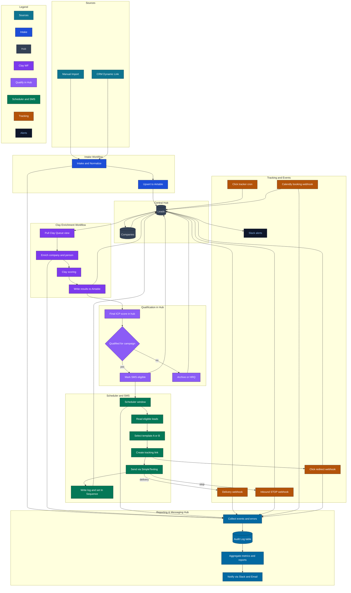

## UYSP — End‑to‑End System Workflow (Preliminary Sketch)

This diagram summarizes the implemented production flows across ingestion, enrichment, qualification, SMS outreach, tracking, and bookings. It reflects the current architecture documented in the runbook and SOPs.

Legend / Notes:
- Airtable `Leads` is the state machine (e.g., "Queued" → "Ready for SMS" → "In Sequence" → "Completed/Stopped").
- Batch Control is applied in the scheduler via an Airtable view filter to safely stage cohorts.
- Click tracking uses unique alias + Switchy; clicks and deliveries update Airtable and send Slack alerts.
- Bookings arrive via Calendly webhooks and stop the active sequence.

Open the standalone HTML viewer in this folder for a full‑screen render.

