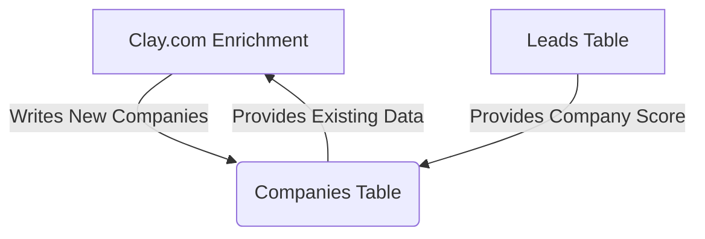

# SOP: Airtable Table - Companies

## 1. Executive Summary
- **Table Name**: `Companies`
- **ID**: `tblfAUBA0JFHLGaR4`
- **Purpose**: This table serves as a permanent, deduplicated cache of enriched company data. Its primary function is to ensure that we only pay for company enrichment **once**. Before enriching any new lead, our system first checks this table. If the lead's company domain already exists here, we reuse the existing data instead of making a new, costly API call.
- **Data Source**: This table is populated exclusively by the **Clay.com enrichment workflow**.

---

## 2. System Map

---

## 3. Field Dictionary & Business Logic

- **`Domain`**: **(CRITICAL)** The unique identifier for each company, extracted from a lead's email address. This is the key Clay uses to check for existing records.
- **`Company Name`**: The official name of the company, found by Clay.
- **`Industry`**: The company's industry, found by Clay.
- **`Company Type`**: A critical classification (e.g., "B2B SaaS") determined by a GPT model within the Clay workflow. This is a major input for scoring.
- **`Company Description`**: A brief summary of what the company does, generated by Clay.
- **`Company Score Component`**: The portion of the ICP score derived from the company's profile (Type, Industry, etc.). This value is calculated by Clay.
- **`Last Enriched`**, **`Enrichment Provider`**, **`Enrichment Cost`**: Fields to track the enrichment history for each company.
- **`Leads`**: A linked record field that shows all the leads in our `Leads` table associated with this company.
