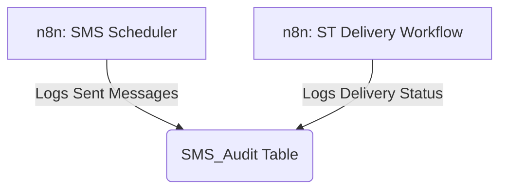

# SOP: Airtable Table - SMS_Audit

## 1. Executive Summary
- **Table Name**: `SMS_Audit`
- **ID**: `tbl5TOGNGdWXTjhzP`
- **Purpose**: This table provides a permanent, unchangeable, and highly detailed log of every single SMS event that occurs in the system. While the `Leads` table shows the *current* status of a lead, this table provides the full *history*. It's our primary tool for compliance, debugging, and detailed reporting.
- **Data Source**: This table is populated exclusively by our **n8n workflows** (`SMS Scheduler` and `ST Delivery`).

---

## 2. System Map

---

## 3. Field Dictionary & Business Logic

- **`Event`**: A simple text field indicating the type of event being logged (e.g., "Sent", "Delivery").
- **`Campaign ID`**: The name of the campaign the message was a part of (e.g., "AI Sales Campaign"). This is critical for filtering and reporting.
- **`Phone`**: The 10-digit phone number the message was sent to.
- **`Status`**: The specific status of the event (e.g., "Sent", "Delivered", "Failed").
- **`Carrier`**: The mobile carrier that handled the message, if provided by the delivery receipt. Useful for debugging delivery issues.
- **`Lead Record ID`**: A direct link back to the lead's record in the `Leads` table.
- **`Text`**: The exact, full body of the message that was sent.
- **`Sent At` / `Delivery At`**: Timestamps for when the message was sent by our system and when the carrier confirmed delivery.
- **`Webhook Raw`**: The complete, raw JSON payload received from the webhook (e.g., from the SimpleTexting delivery report). This is invaluable for deep debugging.
