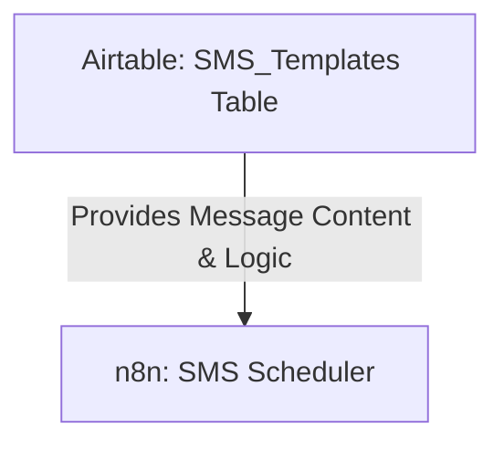

# SOP: Airtable Table - SMS_Templates

## 1. Executive Summary
- **Table Name**: `SMS_Templates`
- **ID**: `tblsSX9dYMnexdAa7`
- **Purpose**: This table stores the master copies of all SMS messages sent by the system. It allows for easy editing of message content, A/B testing, and control over the timing of the sequence, all without needing to touch the n8n workflow.
- **Data Source**: This table is **manually edited**. Its values are read by the `UYSP-SMS-Scheduler-CLEAN` workflow at the beginning of every run.

---

## 2. System Map

---

## 3. Field Dictionary & Business Logic

- **`Campaign`**: The name of the campaign this template belongs to. This is the primary source of truth for the `Campaign ID` that gets logged in the `SMS_Audit` table and sent to Slack.
- **`Variant`**: The A/B test variant for this message. This should be either `A` or `B`. The scheduler will choose a variant for each lead based on the ratios set in the `Settings` table.
- **`Step`**: The position of this message in the sequence. This must be a number (`1`, `2`, or `3`).
- **`Delay Days`**: The number of days the scheduler should wait *after the previous message* before sending this one. This is used when `Fast Mode` is OFF.
- **`Body`**: **(CRITICAL)** The actual text content of the SMS message.
    - **Personalization**: Use `{Name}` (with curly braces) as a placeholder for the lead's first name. The workflow will automatically replace this.
    - **Links**: Paste the direct, full Calendly (or other) URL into this field. The workflow will send it exactly as it appears here.
- **`Fast Delay Minutes`**: The number of minutes the scheduler should wait before sending this message when `Fast Mode` in the `Settings` table is ON. This allows for rapid testing of a full sequence.
