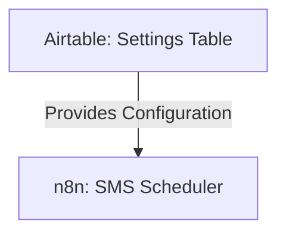

# SOP: Airtable Table - Settings

## 1. Executive Summary
- **Table Name**: `Settings`
- **ID**: `tblErXnFNMKYhh3Xr`
- **Purpose**: This table acts as the central control panel for the entire SMS outreach system. It contains global variables that can be changed by a non-technical user in the Airtable UI to alter the behavior of the n8n workflows without needing to edit any code.
- **Data Source**: This table is **manually edited**. Its values are read by the `UYSP-SMS-Scheduler-CLEAN` workflow at the beginning of every run.

---

## 2. System Map

---

## 3. Field Dictionary & Business Logic

- **`Active Campaign`**: A text field where you can define the official name of the current campaign. This is used as a fallback for reporting in the `SMS_Audit` table and Slack notifications if a specific campaign is not set on an `SMS_Template`.
- **`ab_ratio_a` / `ab_ratio_b`**: These two number fields control the A/B testing split. For example, setting them to `50` and `50` will result in a 50/50 split between Variant A and Variant B templates. Setting them to `80` and `20` would send Variant A 80% of the time.
- **`Test Mode`**: **(CRITICAL)** A checkbox that, when checked, forces all outbound SMS messages to be sent to the single phone number listed in the `Test Phone` field, regardless of the actual lead's phone number. This is our primary safety mechanism for testing.
- **`Test Phone`**: The single, safe phone number (e.g., your own mobile) where all texts are sent when `Test Mode` is active.
- **`Fast Mode`**: A checkbox that, when checked, tells the SMS scheduler to ignore the `Delay Days` setting in the `SMS_Templates` table and instead use the `Fast Delay Minutes`. This allows for rapid, full-sequence testing in minutes instead of days.
- **`Click Tracking`**: A legacy checkbox that is **no longer used**. It has been left in the table for historical purposes, but the link rewriting logic is permanently disabled in the workflow.
