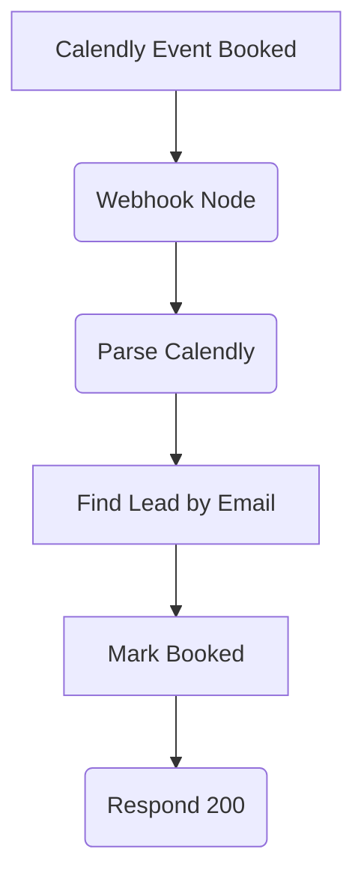

# SOP: n8n Workflow - UYSP-Calendly-Booked

## 1. Executive Summary

- **Purpose**: This workflow handles the critical business event of a lead booking a meeting via Calendly. Its primary function is to immediately stop any further automated SMS messages from being sent to that lead and to update their status to "Completed" in Airtable.
- **Trigger**: It is triggered by a webhook from Calendly, which fires the moment an invitee schedules an event.
- **Key Actions**:
    - Parses the incoming Calendly data to extract the lead's email.
    - Finds the corresponding lead in the Airtable `Leads` table.
    - Sets the `Booked` flag to `true`.
    - Sets the `SMS Stop` flag to `true` to halt any future messages.
    - Updates the lead's `Processing Status` to "Completed".

## 2. System Map

## 3. Node-by-Node Breakdown

1.  **`Webhook (Calendly)`**
    - **Purpose**: Catches the real-time `invitee.created` event from Calendly.
    - **Details**: This node listens for `POST` requests on its unique URL, which is configured in the integration settings of the Calendly account. It's set to respond immediately after the last node, ensuring Calendly gets a quick confirmation.

2.  **`Parse Calendly`**
    - **Purpose**: To extract the lead's email address and the meeting time from the detailed Calendly payload.
    - **Details**: A Code node that navigates the nested JSON structure from Calendly to reliably find the invitee's email. This is the key piece of data used to identify the lead in our system. It also extracts the meeting start time to log when the booking occurred.

3.  **`Find Lead by Email`**
    - **Purpose**: Locates the correct lead record in the `Leads` table using their email address.
    - **Details**: An Airtable node that performs a search on the `Leads` table. It uses a case-insensitive formula to match the `Email` field with the email extracted from the Calendly webhook.

4.  **`Mark Booked`**
    - **Purpose**: Updates the lead's record in Airtable to reflect the successful booking.
    - **Details**: An Airtable "Update" node that performs several critical actions on the found lead record:
        - `Booked`: Sets the checkbox to `true`.
        - `Booked At`: Logs the timestamp of the meeting.
        - `SMS Stop`: Sets the checkbox to `true`. **This is the most critical step**, as it immediately removes the lead from any further consideration by the `SMS Scheduler` workflow.
        - `SMS Stop Reason`: Sets the reason to "BOOKED".
        - `Processing Status`: Sets the status to "Completed", signifying the successful end of this lead's journey through the automated funnel.

5.  **`Respond 200`**
    - **Purpose**: Sends an immediate "OK" (HTTP 200) response back to Calendly.
    - **Details**: A simple Code node that returns a success message. This is important to let Calendly know that the webhook was received and processed successfully, preventing Calendly from attempting to resend it.

## 4. Business Logic

- **Immediate Funnel Exit**: The core logic is to provide an immediate and automated exit from the SMS funnel the moment a lead takes the desired action (booking a meeting). This prevents the awkward and unprofessional situation of sending follow-up messages to a lead who has already converted.
- **Single Source of Truth**: By updating the lead's status directly in Airtable, it ensures that all other parts of the system (like the `SMS Scheduler`) have an up-to-date and accurate view of the lead's status without needing complex cross-workflow communication.

## 5. Maintenance & Troubleshooting

- **Symptom**: Leads are booking meetings, but still receiving SMS messages.
    - **Likely Cause**: The Calendly webhook may be misconfigured, or the workflow is inactive or failing.
    - **Solution**:
        1.  Check the execution history for this workflow in n8n. If there are no new executions after a test booking, the issue is with the webhook configuration in Calendly.
        2.  If executions are failing, inspect the `Find Lead by Email` node. The most common error is that the email used to book the Calendly meeting does not exist in the `Leads` table in Airtable.
        3.  Ensure the Airtable credentials are valid and the `Mark Booked` node has the correct permissions to update records.

## 6. Related SOPs & System Documents

- **SOPs**: `SOP-Airtable-Leads-Table.md`, `SOP-Workflow-SMS-Scheduler.md`
- **Architecture**: `docs/architecture/AIRTABLE-SCHEMA.md`

