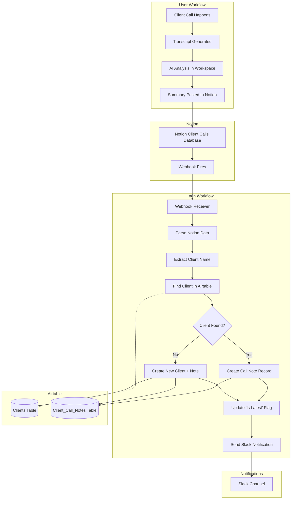

# SOP: n8n Workflow - Client Call Transcript Ingestion

## 1. Executive Summary

- **Workflow Name**: `UYSP-Client-Call-Ingestion`
- **Purpose**: Automates the capture and storage of client call transcripts. When a call summary is uploaded to Notion, this workflow automatically extracts the data and stores it in Airtable for centralized client intelligence and dashboard display.
- **Trigger**: Webhook from Notion (triggered when a new page is created in the designated Client Calls database)
- **Key Actions**:
  - Receives webhook notification from Notion when new call summary is created
  - Extracts call metadata (client name, date, summary, priorities, decisions, blockers)
  - Identifies correct client record in Airtable
  - Creates new record in `Client_Call_Notes` table
  - Links note to client record
  - Sends confirmation notification to Slack

---

## 2. System Map



---

## 3. Detailed Node-by-Node Breakdown

### **Node 1: Webhook (Notion)**
- **Type**: Webhook Trigger
- **Purpose**: Receives real-time notifications from Notion when a new call summary is created
- **Configuration**:
  - Method: POST
  - Path: `/webhook/client-call`
  - Response Mode: Immediately (return 200)
  - Notion Integration: Must be set up via Notion API to watch the Client Calls database

**Expected Payload Structure:**
```json
{
  "page_id": "abc123...",
  "database_id": "def456...",
  "properties": {
    "Client Name": { "title": [{ "plain_text": "Acme Corp" }] },
    "Call Date": { "date": { "start": "2025-10-23" } },
    "Executive Summary": { "rich_text": [{ "plain_text": "..." }] },
    "Top Priorities": { "rich_text": [{ "plain_text": "..." }] },
    "Key Decisions": { "rich_text": [{ "plain_text": "..." }] },
    "Blockers": { "rich_text": [{ "plain_text": "..." }] },
    "Next Steps": { "rich_text": [{ "plain_text": "..." }] },
    "Attendees": { "rich_text": [{ "plain_text": "..." }] },
    "Call Recording URL": { "url": "https://..." },
    "Full Transcript": { "rich_text": [{ "plain_text": "..." }] }
  }
}
```

---

### **Node 2: Parse Notion Data**
- **Type**: Code Node (JavaScript)
- **Purpose**: Extract and normalize data from Notion's complex nested structure
- **Business Logic**:
  - Extracts plain text from Notion's rich_text arrays
  - Normalizes client name (trim, title case)
  - Formats date to ISO standard
  - Handles missing/optional fields gracefully

**Code Logic:**
```javascript
const pageData = $input.item.json;

// Helper function to extract text from Notion rich_text
function getTextValue(property) {
  if (!property) return '';
  
  if (property.title && property.title.length > 0) {
    return property.title[0].plain_text || '';
  }
  if (property.rich_text && property.rich_text.length > 0) {
    return property.rich_text.map(t => t.plain_text).join('') || '';
  }
  if (property.url) {
    return property.url;
  }
  return '';
}

// Extract date
function getDateValue(property) {
  if (!property || !property.date) return null;
  return property.date.start;
}

const props = pageData.properties;

return {
  json: {
    notionPageId: pageData.page_id,
    clientName: getTextValue(props['Client Name']).trim(),
    callDate: getDateValue(props['Call Date']),
    executiveSummary: getTextValue(props['Executive Summary']),
    topPriorities: getTextValue(props['Top Priorities']),
    keyDecisions: getTextValue(props['Key Decisions']),
    blockers: getTextValue(props['Blockers']),
    nextSteps: getTextValue(props['Next Steps']),
    attendees: getTextValue(props['Attendees']),
    recordingUrl: getTextValue(props['Call Recording URL']),
    fullTranscript: getTextValue(props['Full Transcript']),
    timestamp: new Date().toISOString()
  }
};
```

---

### **Node 3: Find Client in Airtable**
- **Type**: Airtable Search
- **Purpose**: Locate the correct client record using the client name from Notion
- **Configuration**:
  - Table: `Clients` (or create if doesn't exist)
  - Search Field: `Client Name`
  - Match Type: Case-insensitive partial match
  
**Filter Formula:**
```
SEARCH(LOWER("{{$json.clientName}}"), LOWER({Client Name})) > 0
```

**Business Logic:**
- If exact match found → proceed to link call note
- If no match found → create new client record first
- Uses fuzzy matching to handle slight variations in client name spelling

---

### **Node 4: IF - Client Exists**
- **Type**: Switch/IF Node
- **Purpose**: Route workflow based on whether client was found
- **Conditions**:
  - Route 1 (True): Client found - proceed to create call note
  - Route 2 (False): Client not found - create client first, then call note

---

### **Node 5A: Create New Client** (Route 2 Only)
- **Type**: Airtable Create
- **Purpose**: Create a new client record when one doesn't exist
- **Table**: `Clients`
- **Fields to Set**:
  - `Client Name`: `{{$json.clientName}}`
  - `First Contact Date`: `{{$json.callDate}}`
  - `Status`: "Active"
  - `Source`: "Call Notes"
  - `Created At`: Auto-populated

---

### **Node 6: Create Call Note Record**
- **Type**: Airtable Create
- **Purpose**: Store the call summary data in the Client_Call_Notes table
- **Table**: `Client_Call_Notes`
- **Fields to Set**:
  - `Client` (Linked Record): Link to client record ID from Node 3 or 5A
  - `Call Date`: `{{$json.callDate}}`
  - `Executive Summary`: `{{$json.executiveSummary}}`
  - `Top Priorities`: `{{$json.topPriorities}}`
  - `Key Decisions`: `{{$json.keyDecisions}}`
  - `Blockers Discussed`: `{{$json.blockers}}`
  - `Next Steps`: `{{$json.nextSteps}}`
  - `Attendees`: `{{$json.attendees}}`
  - `Call Recording URL`: `{{$json.recordingUrl}}`
  - `Full Transcript`: `{{$json.fullTranscript}}`
  - `Notion Page ID`: `{{$json.notionPageId}}`
  - `Is Latest`: `true` (initially set to true; next node will handle clearing old ones)

---

### **Node 7: Clear Previous 'Is Latest' Flags**
- **Type**: Airtable Search + Update
- **Purpose**: Ensure only ONE call note per client has 'Is Latest' = true
- **Business Logic**:
  1. Search for all records in `Client_Call_Notes` where:
     - Client (linked) = current client ID
     - Is Latest = true
     - Record ID ≠ newly created record
  2. Update all found records: Set `Is Latest` = false

**Filter Formula:**
```
AND(
  {Client} = "{{$json.clientId}}",
  {Is Latest} = TRUE(),
  RECORD_ID() != "{{$json.newRecordId}}"
)
```

---

### **Node 8: Send Slack Notification**
- **Type**: Slack Send Message
- **Purpose**: Notify team that a new call summary has been processed
- **Channel**: `#client-updates` (or configured channel)
- **Message Template**:

```
🎙️ **New Client Call Processed**

**Client:** {{$json.clientName}}
**Date:** {{$json.callDate}}
**Attendees:** {{$json.attendees}}

**Executive Summary:**
{{$json.executiveSummary}}

**Top Priorities:**
{{$json.topPriorities}}

🔗 [View in Notion](https://notion.so/{{$json.notionPageId}})
📊 [View in Airtable](https://airtable.com/...)

---
_Automated via UYSP Client Call Ingestion Workflow_
```

---

### **Node 9: Respond Success**
- **Type**: Code Node (Response)
- **Purpose**: Send confirmation back to Notion webhook
- **Code**:
```javascript
return {
  json: {
    success: true,
    message: "Call note processed successfully",
    clientId: $json.clientId,
    noteId: $json.newRecordId,
    timestamp: new Date().toISOString()
  }
};
```

---

## 4. Airtable Schema Requirements

### Table: `Clients`
If this table doesn't exist yet, create it with these fields:

| Field Name | Type | Description | Required |
|------------|------|-------------|----------|
| Client Name | Single Line Text | Primary identifier for client | ✅ Yes |
| Client ID | Auto Number | Unique ID | Auto |
| Status | Single Select | Active, Inactive, Prospect | ✅ Yes |
| First Contact Date | Date | When first engaged | No |
| Primary Contact Email | Email | Main contact | No |
| Primary Contact Phone | Phone | Main contact | No |
| Industry | Single Line Text | Client's industry | No |
| Company Size | Single Select | Small, Medium, Large, Enterprise | No |
| Source | Single Select | Referral, Call Notes, Kajabi, etc. | No |
| Total Calls | Rollup | Count of linked call notes | Auto |
| Latest Call Date | Lookup | From linked latest call note | Auto |
| Notes | Long Text | General client notes | No |

---

### Table: `Client_Call_Notes`
Create this new table with the following structure:

| Field Name | Type | Description | Required |
|------------|------|-------------|----------|
| Record ID | Auto Number | Unique identifier | Auto |
| Client | Link to Clients | Links to Clients table | ✅ Yes |
| Call Date | Date | When the call happened | ✅ Yes |
| Executive Summary | Long Text | 2-3 paragraph summary | ✅ Yes |
| Top Priorities | Long Text | Bulleted priorities | No |
| Key Decisions | Long Text | Important decisions made | No |
| Blockers Discussed | Long Text | Any blockers mentioned | No |
| Next Steps | Long Text | Action items | No |
| Attendees | Single Line Text | Who was on the call | No |
| Call Recording URL | URL | Link to recording | No |
| Full Transcript | Long Text | Complete transcript | No |
| Notion Page ID | Single Line Text | Reference to source | No |
| Is Latest | Checkbox | Mark most recent call | No |
| Created At | Created Time | Auto timestamp | Auto |
| Updated At | Last Modified Time | Auto timestamp | Auto |

**Views to Create:**
1. **All Calls** - All records sorted by Call Date (desc)
2. **Latest Calls Only** - Filter: `Is Latest = true`
3. **By Client** - Grouped by Client
4. **Recent (7 Days)** - Filter: `Call Date >= TODAY()-7`

---

## 5. Notion Database Setup

### Create "Client Calls" Database in Notion

**Required Properties:**
1. **Client Name** (Title) - Name of the client
2. **Call Date** (Date) - When the call occurred
3. **Executive Summary** (Text) - Main summary
4. **Top Priorities** (Text) - Key priorities discussed
5. **Key Decisions** (Text) - Decisions made
6. **Blockers** (Text) - Any blockers
7. **Next Steps** (Text) - Action items
8. **Attendees** (Text) - Who attended
9. **Call Recording URL** (URL) - Link to recording
10. **Full Transcript** (Text) - Complete transcript

**Notion Integration Setup:**
1. Go to Notion Settings → Integrations
2. Create new integration: "UYSP Call Notes Sync"
3. Give it read access to the Client Calls database
4. Copy the integration token
5. Share the Client Calls database with the integration
6. Set up database webhook to fire on "New page created"

**Webhook Configuration:**
- Endpoint: `https://[your-n8n-instance]/webhook/client-call`
- Events: `page.created`
- Database ID: [Your Client Calls DB ID]

---

## 6. User Workflow

### Current State (Manual):
1. ✅ Client call happens
2. ✅ Transcript auto-saved to folder
3. ✅ AI workspace analyzes transcript
4. ✅ Summary generated
5. ❌ **Manual copy-paste to Airtable**

### New State (Automated):
1. ✅ Client call happens
2. ✅ Transcript auto-saved to folder
3. ✅ AI workspace analyzes transcript
4. ✅ Summary generated
5. ✅ **Paste to Notion Client Calls database**
6. 🤖 **Automation takes over:**
   - Notion webhook fires
   - n8n receives notification
   - Client record found/created in Airtable
   - Call note stored with all metadata
   - Previous "Is Latest" flags cleared
   - Slack notification sent
   - Dashboard auto-updates

### User Steps (New Process):
1. Have client call
2. Get transcript (automated)
3. Run through workspace AI analyzer
4. Copy generated summary
5. Open Notion → Client Calls database
6. Click "New" → Fill in:
   - Client Name
   - Call Date
   - Paste summaries into respective fields
7. Click "Create"
8. ✨ **Done!** - Rest happens automatically

---

## 7. Business Logic & Safeguards

### Client Matching Logic
- **Primary**: Exact match on Client Name (case-insensitive)
- **Fallback**: Fuzzy match (searches for partial matches)
- **New Client**: If no match found, creates new client record
- **Prevents Duplicates**: Uses Airtable's built-in uniqueness checking

### "Is Latest" Flag Management
- Only ONE call note per client should have `Is Latest = true`
- When new note is created, all previous notes for that client are set to `Is Latest = false`
- This ensures dashboards/views always show the most recent call
- If user manually backdates a call, they should manually adjust the flag

### Error Handling
- **Missing Client Name**: Workflow fails gracefully, sends error to Slack
- **Invalid Date**: Defaults to current date
- **Empty Summary**: Allowed, but warning sent to Slack
- **Notion Webhook Failures**: n8n retries 3 times with exponential backoff

### Data Validation
- Client Name: Required, minimum 2 characters
- Call Date: Must be valid date, cannot be future date
- Executive Summary: Recommended minimum 50 characters (warning if shorter)

---

## 8. Maintenance & Troubleshooting

### Common Issues

#### **Issue 1: Call note not appearing in Airtable**
**Symptoms:**
- Notion page created but no Airtable record
- No Slack notification received

**Troubleshooting Steps:**
1. Check n8n Executions page
   - Is there a recent execution for this workflow?
   - If NO → Notion webhook not firing
   - If YES → Check execution logs for errors
2. Verify Notion integration
   - Is integration still connected?
   - Does it have access to Client Calls database?
3. Check Airtable credentials
   - Are credentials valid?
   - Does API token have write permissions?

**Solutions:**
- Re-authorize Notion integration
- Refresh Airtable API token
- Manually trigger workflow with test data

---

#### **Issue 2: Wrong client linked**
**Symptoms:**
- Call note created but linked to wrong client
- Multiple similar client names exist

**Root Cause:**
- Fuzzy matching too aggressive
- Client name variations (e.g., "Acme Corp" vs "Acme Corporation")

**Solutions:**
1. Standardize client naming in Notion
2. Update Airtable client name to match Notion exactly
3. Use Notion dropdown/relation instead of text input for Client Name
4. Add "Client ID" field to Notion for explicit linking

---

#### **Issue 3: Duplicate clients being created**
**Symptoms:**
- Same client appears multiple times in Clients table
- Each call creates a new client record

**Root Cause:**
- Client name slight variations
- Search not finding existing record

**Solutions:**
1. Make `Client Name` field unique in Airtable
2. Manual merge of duplicate clients
3. Update search formula to be more lenient:
```
OR(
  LOWER({Client Name}) = LOWER("{{clientName}}"),
  SEARCH(LOWER("{{clientName}}"), LOWER({Client Name})) > 0
)
```

---

#### **Issue 4: "Is Latest" flag not updating**
**Symptoms:**
- Multiple call notes have `Is Latest = true` for same client
- Dashboard shows wrong "latest" call

**Root Cause:**
- Node 7 (Clear Previous Flags) failed
- Airtable update permissions issue

**Solutions:**
1. Manually run Airtable update to clear flags:
   - Filter: `Client = [specific client] AND Is Latest = true`
   - Bulk update: Set `Is Latest = false`
   - Then set correct record to `true`
2. Check n8n execution logs for Node 7 errors
3. Verify Airtable API token has update permissions

---

## 9. Performance & Costs

### Execution Time
- **Average**: 2-3 seconds per call note
- **Breakdown**:
  - Webhook receive: <100ms
  - Parse data: <200ms
  - Airtable search: 300-500ms
  - Airtable create: 300-500ms
  - Clear old flags: 500-800ms
  - Slack notification: 200-300ms

### API Consumption
Per execution:
- **n8n operations**: 6-8 nodes executed
- **Airtable API calls**: 2-3 calls
  - 1 Search (Find Client)
  - 1 Create (Call Note)
  - 0-1 Create (New Client, if needed)
  - 1-2 Updates (Clear Is Latest flags)
- **Notion API**: Webhook only (no active polling)
- **Slack API**: 1 message sent

### Cost Estimate
Assuming 20 client calls per month:
- n8n: ~160 workflow executions (within free tier)
- Airtable: ~60 API calls/month (well within limits)
- Notion: Included in plan
- Slack: Free

**Total additional cost: $0** (within existing platform limits)

---

## 10. Future Enhancements

### Phase 2 Features (Optional)
1. **AI-Powered Client Sentiment Analysis**
   - Analyze transcript for client satisfaction signals
   - Flag calls with negative sentiment for review
   - Track sentiment trends over time

2. **Automatic Action Item Extraction**
   - Parse "Next Steps" to create individual tasks
   - Assign to team members automatically
   - Link to project management system

3. **Client Health Scoring**
   - Calculate health score based on:
     - Call frequency
     - Blocker trends
     - Decision velocity
     - Sentiment analysis
   - Alert when client health drops

4. **Smart Search & Insights**
   - "Show me all calls where [topic] was discussed"
   - "What were the top blockers across all clients this month?"
   - "Which clients haven't had a call in 30+ days?"

5. **Integration with CRM**
   - Sync call notes to HubSpot/Salesforce
   - Update deal stages based on call outcomes
   - Link opportunities to specific call notes

---

## 11. Related SOPs & Documentation

**Related SOPs:**
- `SOP-Airtable-Leads-Table.md` - Airtable table structure patterns
- `SOP-Workflow-Calendly-Booked.md` - Webhook workflow pattern reference
- `SOP-Workflow-Backlog-Ingestion.md` - Data ingestion pattern reference

**Architecture Docs:**
- `docs/architecture/AIRTABLE-SCHEMA.md` - Full Airtable schema
- `docs/architecture/N8N-MINIMAL-WORKFLOWS.md` - n8n best practices

**Implementation Guides:**
- `docs/kajabi-integration/` - Integration patterns (similar approach)

---

## 12. Approval & Sign-off

**Status:** ⚠️ DRAFT - Awaiting Review

**Required Approvals:**
- [ ] Technical Review - Validate n8n workflow logic
- [ ] Airtable Schema - Confirm table structure
- [ ] Notion Setup - Verify database configuration
- [ ] User Acceptance - Test end-to-end workflow

**Implementation Checklist:**
- [ ] Airtable tables created
- [ ] Notion database created
- [ ] Notion integration authorized
- [ ] n8n workflow imported and configured
- [ ] Webhook tested
- [ ] Slack channel configured
- [ ] End-to-end test with real call data
- [ ] User training completed
- [ ] Documentation finalized

---

**Last Updated:** 2025-10-23  
**Version:** 1.0  
**Author:** UYSP Development Team

