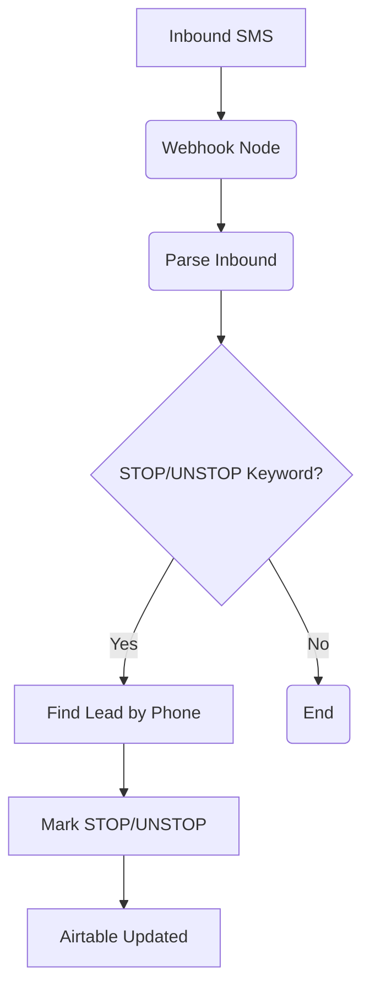

# SOP: n8n Workflow - UYSP-SMS-Inbound-STOP

## 1. Executive Summary

- **Purpose**: This workflow handles inbound SMS messages, specifically looking for legally recognized keywords (like `STOP` or `UNSUBSCRIBE`) to manage compliance. It ensures that any lead who opts out is immediately and permanently flagged in the system to prevent any future messages. It also handles "UNSTOP" requests.
- **Trigger**: It is triggered by a webhook from SimpleTexting, which fires for every inbound message received.
- **Key Actions**:
    - Parses the inbound message to extract the sender's phone number and the message content.
    - Checks the message for STOP or UNSTOP keywords.
    - Finds all lead records in Airtable associated with that phone number.
    - Updates all matching leads to set their `SMS Stop` status accordingly.

## 2. System Map

## 3. Node-by-Node Breakdown

1.  **`Webhook (STOP)`**
    - **Purpose**: Catches all inbound SMS messages sent to our SimpleTexting number.
    - **Details**: This node listens for `POST` requests on its unique URL, which is configured in the SimpleTexting account to receive inbound messages.

2.  **`Parse Inbound`**
    - **Purpose**: To extract the sender's phone number and message text, and to determine if the message is a command.
    - **Details**: A Code node that performs several key steps:
        - It extracts the `phone_digits` and the `text` of the message.
        - It uses a regular expression to check for common STOP keywords (`STOP`, `END`, `QUIT`, `UNSUBSCRIBE`, `CANCEL`) and UNSTOP keywords (`UNSTOP`, `START`, `RESUME`).
        - If a keyword is found, it sets an `action` variable to either "STOP" or "UNSTOP".
        - **If no keyword is found, the workflow stops here.**

3.  **`Find Lead by Phone`**
    - **Purpose**: To find **all** lead records associated with the sender's phone number.
    - **Details**: An Airtable "Search" node. It's critically important that this finds *all* matching records, as a single person could exist as multiple leads (e.g., from different import batches). The search formula cleans and matches the phone number.

4.  **`Mark STOP/UNSTOP`**
    - **Purpose**: Updates all found lead records to reflect the opt-out or opt-in request.
    - **Details**: An Airtable "Update" node that iterates through every record found in the previous step and updates them:
        - If the action is "STOP":
            - `SMS Stop`: Sets to `true`.
            - `SMS Stop Reason`: Sets to "STOP".
            - `Processing Status`: Sets to "Stopped".
        - If the action is "UNSTOP":
            - `SMS Stop`: Sets to `false`.
            - `SMS Stop Reason`: Clears the field.
            - `Processing Status`: Resets to "Queued" so they can potentially re-enter a sequence.

## 4. Business Logic

- **Compliance First**: The primary driver for this workflow is legal compliance (TCPA in the US). The system must provide a reliable and immediate way for recipients to opt out of messaging. This workflow ensures that an opt-out request is honored permanently across all records for that phone number.
- **Global Opt-Out**: A key piece of logic is that a STOP command from a single phone number applies to *all leads* with that phone number. This prevents accidental re-messaging if the same person exists in the database more than once.
- **Keyword-Driven**: The workflow is intentionally simple and only acts on specific, recognized keywords. It ignores all other conversational replies, which are handled manually.

## 5. Maintenance & Troubleshooting

- **Symptom**: A user reports sending "STOP" but still receiving messages.
    - **Likely Cause**: This is a critical failure. The issue could be with the SimpleTexting webhook, the keyword matching logic, or the Airtable update step.
    - **Solution**:
        1.  Immediately check the execution history for this workflow in n8n. Look for an execution corresponding to the time the user sent the message.
        2.  If an execution exists, inspect the output of the `Parse Inbound` node to see if the "STOP" keyword was correctly identified. If not, the regular expression may need to be updated.
        3.  Inspect the `Find Lead by Phone` node to ensure it found the user's record. Check for formatting differences in the phone number.
        4.  Inspect the `Mark STOP/UNSTOP` node to confirm that it successfully updated the `SMS Stop` field to `true`.
- **Symptom**: Workflow is not triggering on inbound messages.
    - **Likely Cause**: The webhook configuration in SimpleTexting is incorrect or has been deactivated.
    - **Solution**: Log into SimpleTexting and verify that the inbound message webhook is active and points to the correct n8n URL for this workflow.

## 6. Related SOPs & System Documents

- **SOPs**: `SOP-Airtable-Leads-Table.md`
- **Architecture**: `docs/architecture/AIRTABLE-SCHEMA.md`

