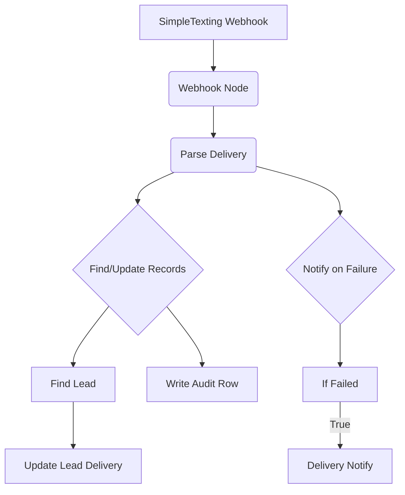

# SOP: n8n Workflow - UYSP-ST-Delivery V2

## 1. Executive Summary

- **Purpose**: This workflow is responsible for processing real-time delivery status updates for every SMS sent by the system. It ensures that both the `Leads` and `SMS_Audit` tables in Airtable are updated with the final delivery outcome (e.g., "Delivered", "Undelivered").
- **Trigger**: It is triggered by a webhook from SimpleTexting, which fires whenever the status of a sent message changes.
- **Key Actions**:
    - Parses the incoming webhook data.
    - Finds the corresponding lead in Airtable.
    - Updates the lead's `SMS Status`.
    - Creates a detailed record in the `SMS_Audit` table.
    - Sends a Slack notification for any non-delivered messages.

## 2. System Map

## 3. Node-by-Node Breakdown

1.  **`Webhook (ST Delivery)`**
    - **Purpose**: Catches the real-time delivery status update from SimpleTexting.
    - **Details**: This is a standard webhook node configured to listen for `POST` requests on its unique URL. This URL is configured within the SimpleTexting account settings.

2.  **`Parse Delivery`**
    - **Purpose**: To extract and standardize the key pieces of information from the webhook's JSON payload.
    - **Details**: A Code node that pulls out the `messageId` (renamed to `campaign_id`), the recipient's phone number (`phone_digits`), the `carrier`, and determines the `delivery_status` ("Delivered" or "Undelivered"). This standardization simplifies the logic for all subsequent nodes.

3.  **`Find Lead (by Campaign/Phone)`**
    - **Purpose**: Locates the correct lead record in the `Leads` table that corresponds to the delivery receipt.
    - **Details**: An Airtable node that searches the `Leads` table. It uses a formula to find a record where the `SMS Campaign ID` matches the incoming `campaign_id` OR the `Phone` number matches the incoming `phone_digits`. This dual-check is a robust way to find the correct lead even if one field is momentarily out of sync.

4.  **`Update Lead Delivery`**
    - **Purpose**: Updates the `SMS Status` field on the lead's record in Airtable.
    - **Details**: An Airtable "Update" node. It takes the Record ID found in the previous step and updates the `SMS Status` field to either "Delivered" or "Undelivered" based on the parsed data.

5.  **`Write Audit Row`**
    - **Purpose**: Creates a definitive log of the delivery event in the `SMS_Audit` table.
    - **Details**: An Airtable "Create" node. It creates a new row in `SMS_Audit`, logging the `Campaign ID`, `Phone`, final `Status`, `Carrier`, the associated `Lead Record ID`, and the exact time of delivery. This provides an immutable record for reporting and troubleshooting.

6.  **`If (Failed)`**
    - **Purpose**: Checks if the message was *not* successfully delivered.
    - **Details**: An IF node that allows the workflow to proceed only if the `delivery_status` is anything other than "Delivered".

7.  **`Delivery Notify`**
    - **Purpose**: Sends an alert to a specific Slack channel if a message fails to deliver.
    - **Details**: A Slack node that formats and sends a message containing the delivery status, phone number, and carrier. This enables immediate visibility into potential issues with phone numbers or carriers.

## 4. Business Logic

- **Asynchronous Updates**: This workflow operates independently of the sending workflow (`SMS Scheduler`). It ensures that the system's final state accurately reflects the reality of the SMS delivery, which can sometimes take minutes to confirm.
- **Failure Monitoring**: The primary business goal is to ensure successful delivery. By explicitly isolating and sending notifications for failures (undelivered messages), the system allows for proactive intervention and data cleanup.
- **Audit Trail**: The creation of an audit record is non-negotiable. It provides the necessary data trail to answer any questions about whether a specific message was sent and delivered to a specific person at a specific time.

## 5. Maintenance & Troubleshooting

- **Symptom**: Leads in Airtable are stuck with an `SMS Status` of "Sent" and never update.
    - **Likely Cause**: The SimpleTexting webhook may be configured incorrectly, or the `UYSP-ST-Delivery V2` workflow might be inactive or have errors.
    - **Solution**:
        1.  Verify the webhook URL in SimpleTexting is correct and points to this workflow.
        2.  Check the execution history of this workflow in n8n for any errors in the `Parse Delivery` or Airtable nodes.
        3.  Ensure the Airtable credentials in the n8n nodes are still valid.
- **Symptom**: Slack notifications for failures are not being sent.
    - **Likely Cause**: The `If` node condition might be incorrect, or the Slack node could have a configuration issue.
    - **Solution**:
        1.  Check the logic in the `If` node to ensure it's correctly identifying non-delivered statuses.
        2.  Send a test message from the Slack node within n8n to ensure the connection and channel configuration are correct.

## 6. Related SOPs & System Documents

- **SOPs**: `SOP-Airtable-SMS_Audit-Table.md`, `SOP-Airtable-Leads-Table.md`, `SOP-Workflow-SMS-Scheduler.md`
- **Architecture**: `docs/architecture/AIRTABLE-SCHEMA.md`

